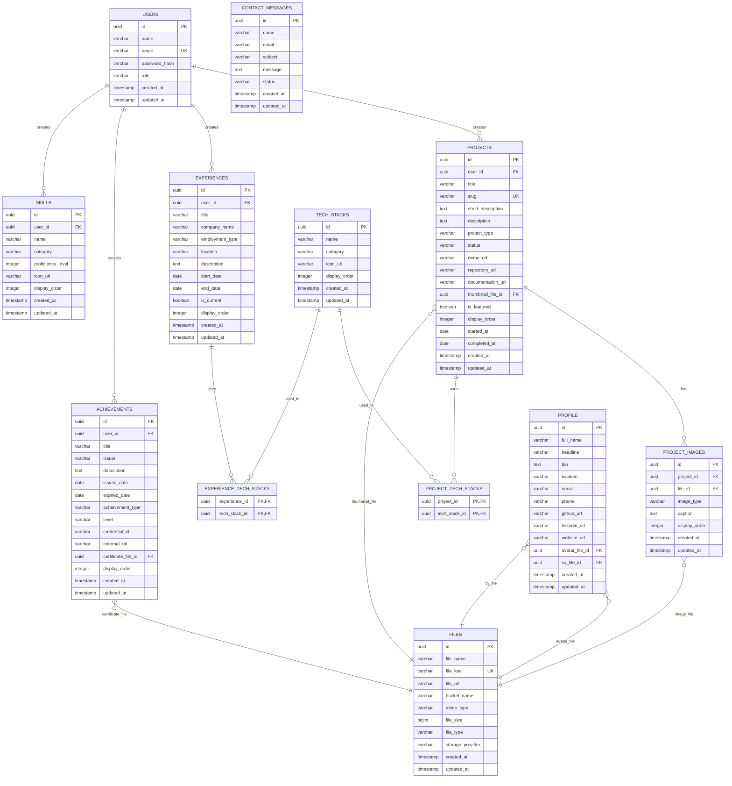

# PRD — Website Portofolio Developer

## 1. Ringkasan Produk

Website Portofolio Developer adalah website personal yang digunakan untuk menampilkan profil developer, karya atau project yang pernah dibuat, pengalaman profesional, magang, prestasi, sertifikasi, dan track record lainnya.

Website ini dirancang agar developer dapat menambahkan, mengubah, atau menghapus data portofolio secara fleksibel tanpa harus mengubah kode utama aplikasi. Data portofolio dikelola melalui dashboard admin, disimpan di PostgreSQL, dan file pendukung seperti gambar, CV, serta sertifikat disimpan di Cloudflare R2.

---

## 2. Latar Belakang

Seorang developer membutuhkan media profesional untuk memperkenalkan diri, menunjukkan kemampuan teknis, membangun personal branding, dan mempermudah recruiter, client, atau collaborator dalam menilai kapasitasnya.

Banyak website portofolio hanya bersifat statis, sehingga setiap kali ingin menambahkan karya baru, developer harus mengubah kode. Hal ini kurang fleksibel dan menyulitkan proses update portofolio secara berkala.

Karena itu, website ini harus mampu menampilkan data secara dinamis, terutama untuk bagian karya, pengalaman, prestasi, dan track record.

---

## 3. Tujuan Produk

Tujuan utama dari website ini adalah:

1. Menampilkan profil developer secara profesional.
2. Menampilkan berbagai karya atau project developer.
3. Memungkinkan developer menambahkan karya baru secara fleksibel tanpa mengubah kode utama.
4. Memungkinkan developer menambahkan Pengalaman baru secara fleksibel tanpa mengubah kode utama.
5. Memungkinkan developer menambahkan Sertifikasi baru secara fleksibel tanpa mengubah kode utama.
6. Menampilkan track record seperti magang, pengalaman kerja, prestasi, organisasi, sertifikasi, dan pencapaian lainnya.
7. Menyediakan halaman atau section yang mudah dipahami oleh recruiter, client, dan pengunjung umum.
8. Menyediakan section atau fitur yang memungkinkan recruiter, client, dan pengunjung umum dapat menghubungi developer dan mengunduh CV.
9. Menjadi media personal branding dan pusat informasi profesional developer.

---

## 4. Target Pengguna

### 4.1 Developer / Pemilik Website

Developer adalah pemilik utama website yang menggunakan portofolio ini untuk menampilkan profil dan karya.

Kebutuhan utama:
- Mengelola daftar project.
- Mengelola data pengalaman.
- Mengelola data prestasi.
- Mengelola profil pribadi.
- Menampilkan skill dan teknologi yang dikuasai.
- Memperbarui konten tanpa mengubah kode utama.

### 4.2 Recruiter / HR

Recruiter mengunjungi website untuk menilai pengalaman, skill, dan rekam jejak developer.

Kebutuhan utama:
- Melihat ringkasan profil developer.
- Melihat project yang relevan.
- Melihat pengalaman magang atau kerja.
- Mengakses CV, LinkedIn, GitHub, dan kontak.

### 4.3 Client / Calon Partner

Client atau calon partner mengunjungi website untuk melihat kualitas karya developer.

Kebutuhan utama:
- Melihat project yang pernah dibuat.
- Melihat detail teknologi yang digunakan.
- Melihat demo atau link project.
- Menghubungi developer dengan mudah.

---

## 5. Ruang Lingkup Produk

### 5.1 Termasuk dalam Scope

Website ini mencakup:

- Halaman utama / landing page.
- Section tentang developer.
- Section karya / project.
- Detail project.
- Section skill.
- Section pengalaman.
- Section prestasi.
- Section sertifikasi.
- Section kontak.
- Fitur pengelolaan data portofolio secara fleksibel.
- Fitur pengelolaan data pengalaman, skill, prestasi, sertifikasi secara fleksibel.
- Responsive design untuk desktop dan mobile.
- Integrasi link eksternal seperti GitHub, LinkedIn, CV, demo project, dan email.
- SEO friendly
- Login (Only Developer to kelola web)

### 5.2 Tidak Termasuk dalam Scope Awal

Untuk versi awal, fitur berikut tidak wajib dibuat:

- Sistem login multi-user.
- Blog lengkap.
- Komentar pengunjung.
- Payment gateway.
- Chat real-time.
- Analytics dashboard kompleks.
- Marketplace jasa.

---

## 6. User Stories

### 6.1 Sebagai Developer

- Sebagai developer, saya ingin menampilkan informasi tentang diri saya agar pengunjung mengenal latar belakang saya.
- Sebagai developer, saya ingin menampilkan daftar project agar pengunjung dapat melihat karya saya.
- Sebagai developer, saya ingin menambahkan project baru tanpa mengubah kode agar update portofolio lebih mudah.
- Sebagai developer, saya ingin menampilkan pengalaman magang, organisasi, dan kerja agar track record saya terlihat jelas.
- Sebagai developer, saya ingin menampilkan prestasi dan sertifikasi agar kredibilitas saya meningkat.
- Sebagai developer, saya ingin menampilkan link GitHub, LinkedIn, CV, dan email agar recruiter atau client mudah menghubungi saya.

### 6.2 Sebagai Recruiter

- Sebagai recruiter, saya ingin melihat ringkasan profil developer agar cepat memahami kemampuan kandidat.
- Sebagai recruiter, saya ingin melihat project yang pernah dibuat agar dapat menilai skill teknis developer.
- Sebagai recruiter, saya ingin melihat pengalaman dan prestasi agar dapat menilai kesesuaian kandidat dengan posisi yang dibutuhkan.
- Sebagai recruiter, saya ingin mengunduh CV agar dapat menyimpan informasi kandidat.

### 6.3 Sebagai Client

- Sebagai client, saya ingin melihat karya developer agar yakin dengan kualitas pekerjaannya.
- Sebagai client, saya ingin melihat detail project agar tahu teknologi dan hasil yang pernah dibuat.
- Sebagai client, saya ingin menghubungi developer dengan mudah untuk diskusi kerja sama.

---

## 7. Fitur Utama

## 7.1 Landing Page

### Deskripsi

Landing page adalah halaman pertama yang dilihat oleh pengunjung. Halaman ini harus memberikan kesan profesional dan langsung menjelaskan siapa developer tersebut.

### Konten Utama

- Nama developer.
- Role atau spesialisasi, misalnya Backend Developer, Data Enthusiast, QA Engineer, Fullstack Developer.
- Tagline singkat.
- Foto atau ilustrasi personal.
- Call-to-action:
  - Lihat Project
  - Download CV
  - Hubungi Saya
  - GitHub / LinkedIn

### Acceptance Criteria

- Pengunjung dapat langsung memahami siapa pemilik website.
- Terdapat tombol menuju section project.
- Terdapat tombol menuju kontak atau CV.
- Tampilan responsif di mobile dan desktop.

---

## 7.2 Section Tentang Developer

### Deskripsi

Section ini menjelaskan informasi personal dan profesional developer secara singkat namun kuat.

### Konten Utama

- Deskripsi singkat tentang developer.
- Minat utama.
- Bidang keahlian.
- Tujuan karier.
- Nilai atau prinsip kerja.
- Lokasi umum, misalnya Indonesia atau Surabaya, tanpa harus alamat lengkap.

### Contoh Konten

Developer yang memiliki minat pada Backend Development, Data, QA, dan pengembangan sistem berbasis teknologi. Memiliki pengalaman membangun dashboard, sistem IoT, machine learning pipeline, dan aplikasi web modern.

### Acceptance Criteria

- Informasi developer mudah dibaca.
- Tidak terlalu panjang.
- Menjelaskan positioning developer secara jelas.
- Dapat diperbarui melalui dashboard admin dan disimpan di database.

---

## 7.3 Section Karya / Project

### Deskripsi

Section ini menampilkan berbagai karya developer dalam bentuk card atau daftar project.

### Konten Project

Setiap project minimal memiliki:

- Judul project.
- Deskripsi singkat.
- Kategori project.
- Teknologi yang digunakan.
- Thumbnail atau gambar.
- Status project.
- Link demo.
- Link GitHub.
- Link dokumentasi.
- Tahun pengerjaan.
- Role developer dalam project.
- Highlight fitur utama.

### Contoh Kategori

- Web Development
- Backend
- Frontend
- Data Science
- Machine Learning
- IoT
- QA / Testing
- Dashboard
- Automation
- Open Source
- Capstone Project

### Fitur Tambahan

- Filter berdasarkan kategori.
- Search project.
- Sorting berdasarkan terbaru atau terlama.
- Label status:
  - Completed
  - In Progress
  - Archived
  - Experimental

### Acceptance Criteria

- Project dapat ditampilkan dalam bentuk card.
- Pengunjung dapat melihat detail project.
- Project dapat difilter berdasarkan kategori.
- Developer dapat menambahkan project baru tanpa mengubah kode utama.
- Jika data project kosong, website menampilkan empty state yang informatif.

---

## 7.4 Detail Project

### Deskripsi

Halaman atau modal detail project digunakan untuk menjelaskan project secara lebih mendalam.

### Konten Detail

- Nama project.
- Ringkasan project.
- Masalah yang diselesaikan.
- Solusi yang dibuat.
- Fitur utama.
- Tech stack.
- Arsitektur singkat.
- Screenshot.
- Link demo.
- Link repository.
- Tantangan teknis.
- Pembelajaran dari project.
- Impact atau hasil.

### Acceptance Criteria

- Pengunjung dapat memahami konteks project.
- Link demo dan repository dapat diklik.
- Screenshot tampil dengan baik.
- Detail project dapat diisi secara fleksibel dari data.

---

## 7.5 Fitur Input Project Fleksibel Tanpa Ubah Kode

### Deskripsi

Website harus memiliki mekanisme agar developer dapat menambahkan karya baru tanpa mengubah kode utama aplikasi.

### Implementasi — Database + Admin Dashboard

Data project disimpan di database dan dikelola lewat halaman admin.

Kelebihan:
- Paling fleksibel.
- Bisa dikembangkan menjadi sistem besar.
- Cocok jika ingin belajar backend dan dashboard admin.

Kekurangan:
- Development lebih lama.
- Perlu autentikasi admin.

### Acceptance Criteria

- Developer dapat menambahkan project baru melalui dashboard admin.
- Developer dapat mengubah dan menghapus project melalui dashboard admin.
- Data project tersimpan di PostgreSQL.
- File gambar project tersimpan di Cloudflare R2.
- Website otomatis menampilkan project yang berstatus published.
- Tidak perlu mengubah komponen UI utama untuk menambahkan project baru.
- Jika ada field kosong, UI tetap aman dan tidak rusak.
---

## 7.6 Section Skill

### Deskripsi

Section ini menampilkan kemampuan teknis developer.

### Konten Skill

Skill dapat dikelompokkan menjadi:

#### Programming Language

- JavaScript
- TypeScript
- Python
- Go
- PHP
- SQL

#### Framework / Library

- Vue
- Nuxt
- Laravel
- Inertia.js
- Express
- TensorFlow
- FastAPI

#### Tools

- Git
- Docker
- Linux
- Postman
- Figma
- VS Code
- Obsidian

#### Database

- MySQL
- PostgreSQL
- MongoDB
- Redis

#### Domain Skill

- Backend Development
- Data Analysis
- Machine Learning
- QA Testing
- IoT
- Dashboard Analytics

### Acceptance Criteria

- Skill dapat dikelompokkan berdasarkan kategori.
- Skill dapat diperbarui dari dashboard.
- Tampilan skill mudah dipindai oleh recruiter.

---

## 7.7 Section Track Record Pengalaman

### Deskripsi

Section ini menampilkan pengalaman developer, baik magang, kerja, organisasi, freelance, volunteer, maupun program pembelajaran.

### Konten Pengalaman

Setiap pengalaman minimal memiliki:

- Nama posisi.
- Nama instansi / perusahaan / organisasi.
- Jenis pengalaman.
- Lokasi atau remote.
- Periode mulai.
- Periode selesai.
- Status saat ini.
- Deskripsi pekerjaan.
- Pencapaian atau kontribusi.
- Teknologi yang digunakan.

### Jenis Pengalaman

- Internship
- Full-time
- Part-time
- Freelance
- Organization
- Volunteer
- Independent Study
- Bootcamp
- Competition

### Acceptance Criteria

- Pengalaman ditampilkan secara timeline.
- Pengunjung dapat melihat periode pengalaman.
- Developer dapat menambahkan pengalaman baru tanpa mengubah kode utama.
- Pengalaman dapat diurutkan berdasarkan tanggal terbaru.

---

## 7.8 Section Prestasi dan Sertifikasi

### Deskripsi

Section ini menampilkan pencapaian developer seperti lomba, penghargaan, sertifikat, publikasi, atau kontribusi tertentu.

### Konten Prestasi

Setiap prestasi minimal memiliki:

- Judul prestasi.
- Penyelenggara.
- Tahun.
- Kategori.
- Deskripsi singkat.
- Link sertifikat atau bukti.
- Gambar sertifikat atau dokumentasi.
- Tingkat:
  - Kampus
  - Regional
  - Nasional
  - Internasional

### Konten Sertifikasi

Setiap sertifikasi minimal memiliki:

- Nama sertifikasi.
- Penerbit.
- Tanggal terbit.
- Tanggal kedaluwarsa jika ada.
- Credential ID.
- Link credential.
- Skill yang divalidasi.

### Acceptance Criteria

- Prestasi dan sertifikasi dapat ditampilkan secara terpisah atau digabung.
- Link credential dapat diklik.
- Data dapat diperbarui tanpa mengubah kode utama.
- Jika sertifikasi tidak memiliki tanggal kedaluwarsa, field tersebut tidak perlu ditampilkan.

---

## 7.9 Section Kontak

### Deskripsi

Section kontak digunakan agar recruiter, client, atau collaborator dapat menghubungi developer.

### Konten Kontak

- Email.
- LinkedIn.
- GitHub.
- Instagram atau X jika relevan.
- WhatsApp jika ingin ditampilkan.
- Form kontak opsional.

### Fitur Form Kontak Opsional

Field form:

- Nama.
- Email.
- Subjek.
- Pesan.

### Acceptance Criteria

- Link kontak dapat diklik.
- Email menggunakan format `mailto:`.
- Link eksternal terbuka di tab baru.
- Form kontak memiliki validasi input jika digunakan.

---

## 7.10 Pengelolaan Data Portfolio

### Deskripsi

Fitur ini digunakan untuk mengelola konten utama website portfolio secara fleksibel tanpa perlu mengubah kode program secara langsung. Developer dapat menambahkan, mengubah, dan menghapus data pengalaman, skill, prestasi, sertifikasi, dan karya/project melalui sistem pengelolaan konten.

### Konten yang Dikelola

- Data pengalaman kerja, magang, organisasi, atau freelance.
- Data skill teknis dan non-teknis.
- Data prestasi atau pencapaian.
- Data sertifikasi.
- Data project atau karya developer.
- Link pendukung seperti GitHub, demo project, sertifikat, dokumentasi, atau artikel.

### Acceptance Criteria

- Developer dapat menambahkan data baru tanpa mengubah kode.
- Developer dapat mengedit dan menghapus data yang sudah ada.
- Data yang ditambahkan otomatis tampil di halaman website.
- Data dapat dikategorikan, misalnya berdasarkan pengalaman, skill, prestasi, sertifikasi, dan project.
- Setiap data dapat memiliki judul, deskripsi, tanggal/periode, gambar, link, dan kategori.
- Tampilan data tetap rapi dan responsif di mobile maupun desktop.

---
## 7.11 SEO Friendly

### Deskripsi

Website harus dioptimalkan agar mudah ditemukan oleh search engine seperti Google. Optimasi SEO bertujuan agar halaman portfolio, project, pengalaman, dan informasi developer dapat terindeks dengan baik.

### Kebutuhan Utama

- Setiap halaman memiliki meta title dan meta description.
- Struktur heading menggunakan urutan yang benar, seperti H1, H2, dan H3.
- URL halaman dibuat jelas dan mudah dibaca.
- Gambar memiliki atribut alt text.
- Website memiliki sitemap.
- Website memiliki robots.txt.
- Konten dapat dibaca dengan baik oleh search engine.
- Website memiliki performa loading yang baik.
- Website mobile-friendly.
- Project atau artikel memiliki slug unik.

### Acceptance Criteria

- Website dapat diindeks oleh search engine.
- Setiap halaman memiliki title dan description yang sesuai.
- URL halaman bersifat SEO-friendly, misalnya `/projects/smart-greenhouse`.
- Gambar penting memiliki alt text.
- Sitemap tersedia dan dapat diakses.
- Robots.txt tersedia dan dapat diakses.
- Website memiliki performa loading yang baik di mobile dan desktop.
- Struktur halaman mudah dipahami oleh pengguna dan search engine.

---

## 7.12 Login Developer

### Deskripsi

Fitur login digunakan khusus oleh developer sebagai pemilik website untuk masuk ke halaman pengelolaan konten. Pengunjung umum tidak memerlukan login untuk melihat website.

### Tujuan

- Melindungi halaman admin agar hanya dapat diakses oleh developer.
- Memberikan akses kepada developer untuk mengelola data portfolio.
- Mencegah pengunjung umum mengubah isi website.

### Fitur Login

- Form login menggunakan email/username dan password.
- Validasi input login.
- Session atau token autentikasi.
- Logout.
- Proteksi halaman admin/dashboard.
- Redirect ke halaman login jika user belum login.
- Role akses hanya untuk developer/admin.

### Acceptance Criteria

- Hanya developer yang dapat login ke dashboard admin.
- Pengunjung umum tidak dapat mengakses halaman pengelolaan data.
- Jika belum login, pengguna diarahkan ke halaman login.
- Setelah login berhasil, developer diarahkan ke dashboard admin.
- Developer dapat logout dari sistem.
- Password tidak disimpan dalam bentuk plain text.
- Halaman admin tidak dapat diakses langsung tanpa autentikasi.

---

## 7.13 Dashboard Admin Developer

### Deskripsi

Dashboard admin adalah halaman khusus untuk developer dalam mengelola seluruh konten website portfolio. Dashboard ini hanya dapat diakses setelah login.

### Fitur Utama

- Melihat ringkasan data portfolio.
- Mengelola data project/karya.
- Mengelola data pengalaman.
- Mengelola data skill.
- Mengelola data prestasi.
- Mengelola data sertifikasi.
- Mengelola informasi profil developer.
- Mengelola link sosial media seperti GitHub, LinkedIn, Instagram, dan email.

### Acceptance Criteria

- Developer dapat melihat daftar data yang sudah dimasukkan.
- Developer dapat menambah, mengubah, dan menghapus data.
- Developer dapat mengatur urutan data yang tampil di website.
- Developer dapat menandai data tertentu sebagai featured/highlight.
- Dashboard hanya dapat diakses oleh developer yang sudah login.

## 8. Struktur Data yang Direkomendasikan

## 8.1 Struktur Data Project

```json
{
  "title": "Sales Analytics Dashboard",
  "slug": "sales-analytics-dashboard",
  "summary": "Dashboard analitik penjualan untuk memantau omzet, traffic, sampling, segmentasi pelanggan, dan performa customer.",
  "category": "Dashboard",
  "status": "Completed",
  "year": "2025",
  "role": "Fullstack Developer",
  "techStack": ["Vue 3", "Inertia.js", "Laravel", "ApexCharts", "MySQL"],
  "thumbnailUrl": "https://cdn.domainkamu.com/projects/sales-dashboard/thumbnail.webp",
  "thumbnailKey": "projects/sales-dashboard/thumbnail.webp",
  "demoUrl": "https://example.com",
  "githubUrl": "https://github.com/username/project",
  "documentationUrl": "https://docs.example.com",
  "features": [
    "Visualisasi omzet",
    "Grafik traffic kunjungan",
    "Segmentasi pelanggan",
    "Filter berdasarkan rentang tanggal"
  ],
  "problem": "Data penjualan tersebar dan sulit dianalisis secara cepat.",
  "solution": "Membangun dashboard terpusat untuk membantu monitoring performa bisnis.",
  "impact": "Mempermudah analisis data penjualan dan pengambilan keputusan.",
  "isFeatured": true
}
```

---

## 8.2 Struktur Data Pengalaman

```json
{
  "title": "Machine Learning Cohort",
  "organization": "Bangkit Academy",
  "type": "Independent Study",
  "location": "Remote",
  "startDate": "2024-09",
  "endDate": "2025-01",
  "isCurrent": false,
  "description": "Mengikuti program studi independen dengan fokus pada machine learning, Python, data analysis, dan capstone project.",
  "responsibilities": [
    "Menyelesaikan course Python dan data analysis",
    "Mengembangkan model machine learning sederhana",
    "Mengerjakan capstone project bersama tim"
  ],
  "techStack": ["Python", "TensorFlow", "Pandas", "Streamlit"]
}
```

---

## 8.3 Struktur Data Prestasi

```json
{
  "title": "Finalist National Competition",
  "issuer": "Nama Penyelenggara",
  "year": "2024",
  "level": "National",
  "category": "Competition",
  "description": "Menjadi finalis dalam kompetisi tingkat nasional di bidang teknologi.",
  "certificateUrl": "https://cdn.domainkamu.com/certificates/finalist-national-competition.pdf",
  "imageUrl": "https://cdn.domainkamu.com/achievements/finalist-national-competition.webp"

}
```

---

## 8.4 Struktur Data Skill

```json
{
  "category": "Backend",
  "items": [
    "Laravel",
    "Go",
    "REST API",
    "JWT Authentication",
    "MySQL",
    "PostgreSQL"
  ]
}
```

---

## 9. Halaman dan Navigasi

### 9.1 Struktur Halaman MVP

```txt
/
├── Home
├── About
├── Projects
│   └── Project Detail
├── Experience
├── Achievements
├── Skills
└── Contact
```

### 9.2 Navigasi Utama

Menu utama:

- Home
- About
- Projects
- Experience
- Achievements
- Contact

### Acceptance Criteria

- Navigasi mudah digunakan.
- Menu aktif sesuai section.
- Pada mobile, navigasi berubah menjadi hamburger menu.
- Pengunjung dapat kembali ke halaman utama dengan mudah.

---

## 10. Kebutuhan UI/UX

### 10.1 Prinsip Desain

Website harus memiliki desain:

- Profesional.
- Bersih.
- Modern.
- Mudah dibaca.
- Tidak terlalu ramai.
- Fokus pada konten.
- Responsif untuk semua ukuran layar.

### 10.2 Komponen UI

Komponen utama:

- Navbar.
- Hero section.
- Project card.
- Project detail page.
- Timeline experience.
- Achievement card.
- Skill badge.
- Contact card.
- Footer.
- Search input.
- Filter dropdown.
- Button CTA.

### 10.3 Responsive Design

Website harus optimal pada:

- Mobile.
- Tablet.
- Laptop.
- Desktop besar.

### Acceptance Criteria

- Layout tidak rusak pada layar kecil.
- Text tetap mudah dibaca.
- Card project tersusun rapi.
- Tombol mudah diklik di mobile.

---

## 11. Kebutuhan Fungsional

| Kode | Kebutuhan | Prioritas |
|---|---|---|
| FR-001 | Website menampilkan profil developer | Must Have |
| FR-002 | Website menampilkan daftar project | Must Have |
| FR-003 | Website menampilkan detail project | Must Have |
| FR-004 | Website dapat membaca data project dari sumber eksternal seperti  database | Must Have |
| FR-005 | Developer dapat menambahkan project tanpa mengubah kode UI utama | Must Have |
| FR-006 | Developer dapat menambahkan pengalaman tanpa mengubah kode UI utama | Must Have |
| FR-007 | Website menampilkan pengalaman / track record | Must Have |
| FR-008 | Website menampilkan prestasi dan sertifikasi | Must Have |
| FR-009 | Website menampilkan skill developer | Should Have |
| FR-010 | Website memiliki fitur filter project | Should Have |
| FR-011 | Website memiliki fitur search project | Should Have |
| FR-012 | Website menyediakan link kontak | Must Have |
| FR-013 | Website menyediakan download CV | Must Have |
| FR-014 | Website memiliki admin dashboard | Must Have |
| FR-015 | Website memiliki fitur login (only developer) | Must Have |
| FR-016 | Website memiliki form kontak | Could Have |
| FR-017 | Website memiliki blog | Could Have |

---

## 12. Kebutuhan Non-Fungsional

| Kode | Kebutuhan | Target |
|---|---|---|
| NFR-001 | Performance | Halaman utama dimuat kurang dari 3 detik pada koneksi normal |
| NFR-002 | SEO | Setiap halaman penting memiliki title, description, dan metadata |
| NFR-003 | Accessibility | Kontras warna cukup dan elemen dapat dinavigasi dengan keyboard |
| NFR-004 | Responsiveness | Website berjalan baik di mobile, tablet, dan desktop |
| NFR-005 | Maintainability | Data konten mudah diperbarui tanpa mengubah komponen utama |
| NFR-006 | Security | Jika ada admin dashboard, wajib menggunakan autentikasi |
| NFR-007 | Reliability | Website tetap menampilkan fallback jika data kosong atau error |
| NFR-008 | Scalability | Struktur data memungkinkan penambahan banyak project |
| NFR-009 | Scalability | Struktur data memungkinkan penambahan banyak pengalaman |
| NFR-010 | Compatibility | Website berjalan baik di browser modern |
| NFR-011 | Backup | Jika menggunakan CMS/database, data harus dapat diekspor atau dibackup |

---

## 13. Rekomendasi Tech Stack

| Layer | Teknologi | Alasan |
|---|---|---|
| Frontend | Nuxt | Mendukung SEO, routing, SSR/SSG, dan cocok dengan ekosistem Vue |
| Backend | Go | Ringan, cepat, cocok untuk REST API dan showcase backend |
| Database | PostgreSQL | Stabil untuk data relasional seperti project, skill, pengalaman, dan achievement |
| Auth | JWT via HTTP-only Cookie | Lebih aman dibanding menyimpan token di localStorage |
| Storage | Cloudflare R2 | Cocok untuk gambar, CV, sertifikat, dan asset public |
| Deployment | VPS + Docker + Nginx | Fleksibel dan mendekati production setup |

Kelebihan:
- Lebih fleksibel.
- Bisa mengelola konten dari dashboard.
- Cocok untuk portfolio yang berkembang.

## 14. MVP Scope

### 14.1 MVP Core

- Landing page.
- About developer.
- List project.
- Detail project.
- Data project dari database.
- Login admin.
- CRUD project.
- Upload thumbnail project ke Cloudflare R2.
- Contact link.
- Responsive design.
- SEO dasar.

### 14.2 MVP Extended

- Experience timeline.
- Achievement / certification section.
- Skill section.
- CRUD experience.
- CRUD achievement.
- CRUD skill.
- Upload sertifikat.
- Download CV.
- Preview sebelum publish.

### 14.3 Tidak Termasuk MVP

- Blog.
- Dark mode.
- Multi-language.
- Contact form backend.
- Analytics dashboard kompleks.

---

## 15. Success Metrics

Produk dianggap berhasil jika:

- Pengunjung dapat memahami profil developer dalam waktu kurang dari 30 detik.
- Recruiter dapat menemukan project, pengalaman, dan kontak dengan mudah.
- Developer dapat menambahkan project,pengalaman, dan skill baru tanpa mengubah kode UI utama.
- Lighthouse Performance minimal 85 pada mobile.
- Lighthouse SEO minimal 90.
- Halaman utama dapat dimuat kurang dari 3 detik pada koneksi 4G normal.
- Recruiter dapat menemukan tombol download CV dalam maksimal 2 klik.
- Developer dapat menambahkan project baru melalui dashboard dalam waktu kurang dari 3 menit.
- Website mampu menyimpan minimal 20 project tanpa perubahan struktur database.
- Website dapat digunakan sebagai link utama personal branding.

---

## 16. Risiko dan Mitigasi

| Risiko | Dampak | Mitigasi |
|---|---|---|
| Data project tidak konsisten | UI rusak atau informasi tidak tampil | Gunakan schema validasi |
| Terlalu banyak animasi | Website lambat | Gunakan animasi secukupnya |
| Konten terlalu panjang | Pengunjung sulit memahami | Gunakan ringkasan dan halaman detail |
| Link demo mati | Kredibilitas menurun | Tambahkan status project dan fallback |
| Gambar terlalu besar | Website lambat | Optimasi gambar dan lazy loading |
| Upload file tidak tervalidasi | Risiko keamanan dan storage penuh	| Validasi MIME type, ukuran file, dan ekstensi |
| File R2 orphaned	| Storage penuh karena file tidak terpakai	| Hapus file lama saat data dihapus/diupdate |
| JWT tidak aman	| Admin dashboard rentan	| Gunakan HTTP-only cookie, password hash, rate limit login |
| Database hilang/rusak	| Konten website hilang	| Jadwalkan backup PostgreSQL |
---

## 17. Roadmap Pengembangan

## Phase 1 — MVP Core

Fokus:

- Desain halaman utama.
- About section.
- Project list.
- Project detail.
- Login admin.
- CRUD project.
- Upload thumbnail project.
- Data project berbasis database.
- SEO dasar.
- Responsive design.

Output:

- Website portofolio versi awal siap online.
- Project dapat dikelola melalui dashboard admin.
- Gambar project dapat disimpan di Cloudflare R2.
- Website dapat menampilkan project published ke halaman public.

## Phase 2 — Enhancement

Fokus:

- Search project.
- Filter project.
- Experience timeline.
- Achievement section.
- Contact section.
- CRUD experience.
- CRUD achievement.
- Upload gambar.
- Preview sebelum publish
- Dark mode.
- Download CV.
- Animasi ringan.
- Optimasi performa.

Output:

- Website lebih interaktif dan nyaman digunakan.

## Phase 3 Advanced Personal Branding

Fokus:

- SEO lanjutan.
- Blog.
- Newsletter.
- Analytics.
- Multi-language.
- Case study mendalam.
- Integrasi GitHub API.

Output:

- Website menjadi pusat personal branding developer.

---

## 18. Prioritas Fitur

| Fitur | Prioritas |
|---|---|
| Hero / Landing Page | P0 |
| About Developer | P0 |
| Project List | P0 |
| Project Detail | P0 |
| Flexible Project Data | P0 |
| Experience Timeline | P0 |
| Achievement / Certification | P0 |
| Admin Dashboard | P0 |
| Contact Link | P0 |
| Skill Section | P1 |
| Search & Filter Project | P1 |
| Download CV | P1 |
| Dark Mode | P2 |
| Contact Form | P2 |
| Blog | P3 |

---

## 19. Contoh Struktur Folder

Jika menggunakan Nuxt dan database content:

```txt
portfolio-website/
├── frontend/
│   ├── assets/
│   │   └── images/
│   │
│   ├── components/
│   │   ├── sections/
│   │   │   ├── HeroSection.vue
│   │   │   ├── AboutSection.vue
│   │   │   ├── ProjectSection.vue
│   │   │   ├── ExperienceSection.vue
│   │   │   ├── AchievementSection.vue
│   │   │   └── ContactSection.vue
│   │   │
│   │   ├── cards/
│   │   │   ├── ProjectCard.vue
│   │   │   ├── AchievementCard.vue
│   │   │   └── SkillCard.vue
│   │   │
│   │   └── layout/
│   │       ├── Navbar.vue
│   │       └── Footer.vue
│   │
│   ├── composables/
│   │   ├── useProjects.ts
│   │   ├── useExperiences.ts
│   │   ├── useAchievements.ts
│   │   └── useContact.ts
│   │
│   ├── layouts/
│   │   ├── default.vue
│   │   └── admin.vue
│   │
│   ├── pages/
│   │   ├── index.vue
│   │   ├── about.vue
│   │   ├── contact.vue
│   │   │
│   │   ├── projects/
│   │   │   ├── index.vue
│   │   │   └── [slug].vue
│   │   │
│   │   └── admin/
│   │       ├── login.vue
│   │       ├── dashboard.vue
│   │       ├── projects/
│   │       │   ├── index.vue
│   │       │   ├── create.vue
│   │       │   └── [id].vue
│   │       ├── experiences/
│   │       │   └── index.vue
│   │       └── achievements/
│   │           └── index.vue
│   │
│   ├── plugins/
│   │   └── api.ts
│   │
│   ├── public/
│   │   ├── favicon.ico
│   │   └── robots.txt
│   │
│   ├── types/
│   │   ├── project.ts
│   │   ├── experience.ts
│   │   ├── achievement.ts
│   │   └── user.ts
│   │
│   ├── nuxt.config.ts
│   ├── package.json
│   └── .env.example
│
├── backend/
│   ├── cmd/
│   │   └── api/
│   │       └── main.go
│   │
│   ├── internal/
│   │   ├── config/
│   │   │   └── config.go
│   │   │
│   │   ├── database/
│   │   │   ├── postgres.go
│   │   │   └── migration.go
│   │   │
│   │   ├── middleware/
│   │   │   ├── auth.go
│   │   │   ├── cors.go
│   │   │   └── logger.go
│   │   │
│   │   ├── models/
│   │   │   ├── project.go
│   │   │   ├── experience.go
│   │   │   ├── achievement.go
│   │   │   ├── skill.go
│   │   │   └── user.go
│   │   │
│   │   ├── repositories/
│   │   │   ├── project_repository.go
│   │   │   ├── experience_repository.go
│   │   │   ├── achievement_repository.go
│   │   │   └── user_repository.go
│   │   │
│   │   ├── services/
│   │   │   ├── project_service.go
│   │   │   ├── experience_service.go
│   │   │   ├── achievement_service.go
│   │   │   ├── auth_service.go
│   │   │   └── upload_service.go
│   │   │
│   │   ├── handlers/
│   │   │   ├── project_handler.go
│   │   │   ├── experience_handler.go
│   │   │   ├── achievement_handler.go
│   │   │   ├── auth_handler.go
│   │   │   ├── upload_handler.go
│   │   │   └── contact_handler.go
│   │   │
│   │   ├── routes/
│   │   │   └── routes.go
│   │   │
│   │   └── utils/
│   │       ├── slug.go
│   │       ├── response.go
│   │       ├── validator.go
│   │       └── jwt.go
│   │
│   ├── migrations/
│   │   ├── 001_create_users_table.sql
│   │   ├── 002_create_projects_table.sql
│   │   ├── 003_create_experiences_table.sql
│   │   ├── 004_create_achievements_table.sql
│   │   └── 005_create_skills_table.sql
│   │
│   ├── go.mod
│   ├── go.sum
│   ├── Dockerfile
│   └── .env.example
│
├── nginx/
│   └── default.conf
│
├── docker/
│   ├── frontend.Dockerfile
│   └── backend.Dockerfile
│
├── docker-compose.yml
├── README.md
└── .gitignore
``` 
---

## 20. Entity Relationship Diagram / ERD Database

Database digunakan untuk menyimpan data utama website portofolio seperti profil developer, project, pengalaman, skill, achievement, pesan kontak, user admin, serta metadata file dari Cloudflare R2.

File seperti gambar project, avatar, CV, dan sertifikat **tidak disimpan langsung di database**, tetapi disimpan di **Cloudflare R2**. Database hanya menyimpan metadata file seperti `file_key`, `file_url`, `bucket_name`, `mime_type`, `file_size`, dan `storage_provider`.

---

## 20.1 ERD Diagram



## 20.2 Ringkasan Tabel

| Tabel | Fungsi |
|---|---|
| users | Menyimpan akun admin/developer |
| profile | Menyimpan profil utama developer |
| projects | Menyimpan data project/karya |
| project_images | Menyimpan galeri gambar project |
| tech_stacks | Menyimpan daftar teknologi |
| project_tech_stacks | Pivot project dan tech stack |
| experiences | Menyimpan pengalaman kerja/magang/organisasi |
| experience_tech_stacks | Pivot experience dan tech stack |
| achievements | Menyimpan prestasi dan sertifikasi |
| skills | Menyimpan skill developer |
| files | Menyimpan metadata file Cloudflare R2 |
| contact_messages | Menyimpan pesan dari form kontak |
---

## 21. API Contract

API dibagi menjadi dua jenis akses:

1. **Public API**  
   Endpoint yang dapat diakses oleh pengunjung umum tanpa login. Endpoint ini digunakan untuk menampilkan data portfolio pada halaman public.

2. **Admin API**  
   Endpoint yang hanya dapat diakses oleh developer/admin setelah login. Endpoint ini digunakan untuk mengelola konten portfolio melalui dashboard admin.

Catatan: Endpoint login secara teknis bersifat public karena admin belum memiliki session/token sebelum login. Namun endpoint ini hanya digunakan pada halaman admin login dan tidak ditampilkan pada halaman public website.

---

## 21.1 Auth

| Method | Endpoint | Deskripsi | Akses |
|---|---|---|---|
| POST | `/api/auth/login` | Login developer/admin untuk mendapatkan session/token | Public khusus admin login |
| POST | `/api/auth/logout` | Logout developer/admin | Admin |
| GET | `/api/auth/me` | Mengambil data user admin yang sedang login | Admin |

### Catatan Auth

- Pengunjung umum tidak perlu login untuk melihat website portfolio.
- Halaman login hanya tersedia untuk developer/admin.
- Endpoint `/api/auth/login` tidak ditampilkan di navigasi public.
- Setelah login berhasil, admin dapat mengakses dashboard dan endpoint `/api/admin/*`.
- Token autentikasi disarankan disimpan menggunakan **HTTP-only cookie**, bukan `localStorage`.

---

## 21.2 Public Portfolio API

Endpoint berikut dapat diakses tanpa login karena digunakan untuk menampilkan konten portfolio kepada pengunjung umum.

| Method | Endpoint | Deskripsi | Akses |
|---|---|---|---|
| GET | `/api/profile` | Mengambil profil developer | Public |
| GET | `/api/profile/cv` | Mengambil URL CV developer | Public |
| GET | `/api/projects` | Mengambil daftar project yang berstatus published | Public |
| GET | `/api/projects/:slug` | Mengambil detail project berdasarkan slug | Public |
| GET | `/api/experiences` | Mengambil daftar pengalaman yang ditampilkan ke public | Public |
| GET | `/api/achievements` | Mengambil daftar prestasi/sertifikasi yang ditampilkan ke public | Public |
| GET | `/api/skills` | Mengambil daftar skill developer | Public |

### Catatan Public API

- Public API hanya menampilkan data yang boleh dilihat oleh pengunjung.
- Project dengan status `draft` atau `archived` tidak ditampilkan.
- Data sensitif seperti `password_hash`, token, dan data internal admin tidak boleh pernah dikirim ke response public.
- Public API tidak boleh memiliki operasi tambah, ubah, atau hapus data.

---

## 21.3 Admin Management API

Endpoint berikut hanya dapat diakses oleh developer/admin yang sudah login.

### 21.3.1 Admin Project Management

| Method | Endpoint | Deskripsi | Akses |
|---|---|---|---|
| GET | `/api/admin/projects` | Mengambil semua project termasuk draft dan archived | Admin |
| GET | `/api/admin/projects/:id` | Mengambil detail project untuk kebutuhan edit | Admin |
| POST | `/api/admin/projects` | Membuat project baru | Admin |
| PUT | `/api/admin/projects/:id` | Mengubah project | Admin |
| DELETE | `/api/admin/projects/:id` | Menghapus project | Admin |

---

### 21.3.2 Admin Experience Management

| Method | Endpoint | Deskripsi | Akses |
|---|---|---|---|
| GET | `/api/admin/experiences` | Mengambil semua data pengalaman | Admin |
| GET | `/api/admin/experiences/:id` | Mengambil detail pengalaman | Admin |
| POST | `/api/admin/experiences` | Membuat pengalaman baru | Admin |
| PUT | `/api/admin/experiences/:id` | Mengubah pengalaman | Admin |
| DELETE | `/api/admin/experiences/:id` | Menghapus pengalaman | Admin |

---

### 21.3.3 Admin Achievement Management

| Method | Endpoint | Deskripsi | Akses |
|---|---|---|---|
| GET | `/api/admin/achievements` | Mengambil semua data prestasi/sertifikasi | Admin |
| GET | `/api/admin/achievements/:id` | Mengambil detail prestasi/sertifikasi | Admin |
| POST | `/api/admin/achievements` | Membuat prestasi/sertifikasi baru | Admin |
| PUT | `/api/admin/achievements/:id` | Mengubah prestasi/sertifikasi | Admin |
| DELETE | `/api/admin/achievements/:id` | Menghapus prestasi/sertifikasi | Admin |

---

### 21.3.4 Admin Skill Management

| Method | Endpoint | Deskripsi | Akses |
|---|---|---|---|
| GET | `/api/admin/skills` | Mengambil semua data skill | Admin |
| POST | `/api/admin/skills` | Membuat skill baru | Admin |
| PUT | `/api/admin/skills/:id` | Mengubah skill | Admin |
| DELETE | `/api/admin/skills/:id` | Menghapus skill | Admin |

---

### 21.3.5 Admin Profile Management

| Method | Endpoint | Deskripsi | Akses |
|---|---|---|---|
| GET | `/api/admin/profile` | Mengambil data profil untuk dashboard admin | Admin |
| PUT | `/api/admin/profile` | Mengubah profil developer | Admin |

---

### 21.3.6 Upload Management

| Method | Endpoint | Deskripsi | Akses |
|---|---|---|---|
| POST | `/api/admin/uploads/images` | Upload gambar ke Cloudflare R2 | Admin |
| POST | `/api/admin/uploads/files` | Upload file PDF/CV/sertifikat ke Cloudflare R2 | Admin |
| DELETE | `/api/admin/uploads/:id` | Menghapus file dari database dan Cloudflare R2 | Admin |

### Catatan Upload

- Upload hanya boleh dilakukan oleh admin yang sudah login.
- File gambar yang diperbolehkan: `jpg`, `jpeg`, `png`, `webp`.
- File dokumen yang diperbolehkan: `pdf`.
- Backend wajib memvalidasi MIME type, ekstensi file, dan ukuran file.
- Metadata file disimpan di PostgreSQL.
- File fisik disimpan di Cloudflare R2.

---

## 21.4 Contact API

Jika form kontak digunakan, endpoint berikut dapat disediakan.

| Method | Endpoint | Deskripsi | Akses |
|---|---|---|---|
| POST | `/api/contact` | Mengirim pesan dari pengunjung | Public |
| GET | `/api/admin/contact-messages` | Melihat daftar pesan masuk | Admin |
| GET | `/api/admin/contact-messages/:id` | Melihat detail pesan masuk | Admin |
| PUT | `/api/admin/contact-messages/:id/status` | Mengubah status pesan | Admin |
| DELETE | `/api/admin/contact-messages/:id` | Menghapus pesan | Admin |

### Catatan Contact API

- Endpoint `/api/contact` bersifat public karena digunakan oleh pengunjung.
- Form kontak wajib memiliki validasi input.
- Disarankan menambahkan rate limit untuk mencegah spam.
- Jika contact form belum masuk MVP, endpoint ini dapat dipindahkan ke fase berikutnya.

---

## 21.5 Access Control Summary

| Area | Perlu Login? | Keterangan |
|---|---|---|
| Halaman public portfolio | Tidak | Bisa diakses semua pengunjung |
| Public API `/api/profile`, `/api/projects`, dll | Tidak | Hanya untuk membaca data published |
| Halaman `/admin/login` | Tidak | Hanya diketahui/digunakan oleh admin |
| Endpoint `/api/auth/login` | Tidak | Public secara teknis, tetapi khusus proses login admin |
| Dashboard `/admin/*` | Ya | Hanya admin yang sudah login |
| Endpoint `/api/admin/*` | Ya | Wajib autentikasi |
| Upload file | Ya | Hanya admin |
| CRUD data portfolio | Ya | Hanya admin |

---

## 21.6 Security Notes

- Jangan mengandalkan “endpoint login hanya admin yang tahu” sebagai keamanan utama.
- Endpoint login tetap harus aman walaupun URL-nya diketahui orang lain.
- Gunakan password hash seperti `bcrypt` atau `argon2`.
- Gunakan HTTP-only cookie untuk menyimpan token/session.
- Tambahkan rate limit pada endpoint login.
- Tambahkan proteksi CORS agar hanya domain frontend resmi yang dapat mengakses API.
- Semua endpoint `/api/admin/*` wajib menggunakan middleware autentikasi.

---

## 22. Environment Variables

### Backend

| Variable | Fungsi |
|---|---|
| `APP_ENV` | Menentukan environment aplikasi |
| `APP_PORT` | Port backend Go |
| `DATABASE_URL` | Koneksi PostgreSQL |
| `JWT_SECRET` | Secret untuk token autentikasi |
| `R2_ACCOUNT_ID` | Account ID Cloudflare R2 |
| `R2_ACCESS_KEY_ID` | Access key Cloudflare R2 |
| `R2_SECRET_ACCESS_KEY` | Secret key Cloudflare R2 |
| `R2_BUCKET_NAME` | Nama bucket Cloudflare R2 |
| `R2_PUBLIC_URL` | URL public CDN R2 |

### Frontend

| Variable | Fungsi |
|---|---|
| `NUXT_PUBLIC_API_BASE_URL` | Base URL backend API |
| `NUXT_PUBLIC_SITE_URL` | URL public website |
---

## 23. Security Requirements

- Password admin wajib di-hash menggunakan `bcrypt` atau `argon2`.
- Token autentikasi disimpan pada HTTP-only cookie.
- Endpoint `/api/admin/*` wajib dilindungi middleware autentikasi.
- Upload file wajib divalidasi berdasarkan MIME type, ekstensi, dan ukuran.
- Login wajib memiliki rate limiting.
- CORS hanya mengizinkan domain frontend resmi.
- Public API tidak boleh mengembalikan data sensitif seperti `password_hash`, token, atau konfigurasi internal.
---

## 24. Kesimpulan

Website Portofolio Developer ini bertujuan menjadi pusat personal branding yang menampilkan profil, karya, pengalaman, prestasi, sertifikasi, dan kontak developer secara profesional.

Fitur paling penting adalah kemampuan mengelola konten portofolio secara fleksibel tanpa mengubah kode utama. Untuk MVP, pendekatan database-driven content menggunakan PostgreSQL dan Cloudflare R2 dipilih karena lebih fleksibel, terstruktur, dan skalabel.

Dengan arsitektur Nuxt, Go, PostgreSQL, Cloudflare R2, Docker, dan Nginx, project ini tidak hanya berfungsi sebagai website portofolio, tetapi juga sebagai showcase kemampuan full-stack development.
