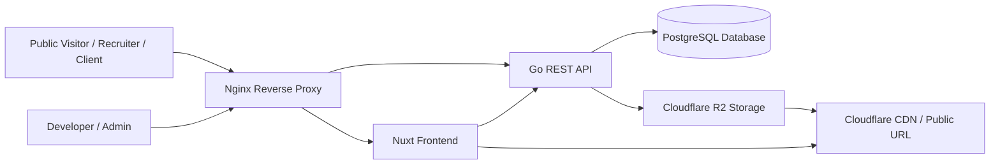
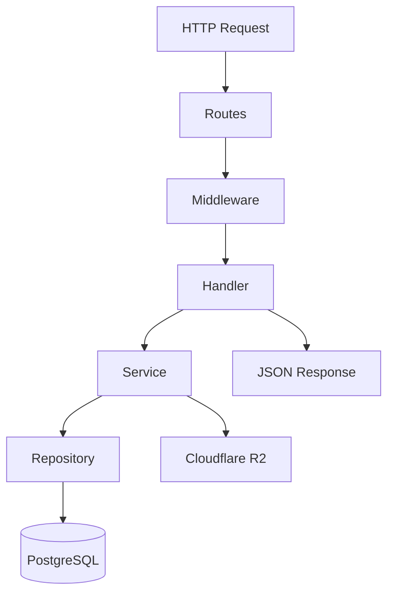
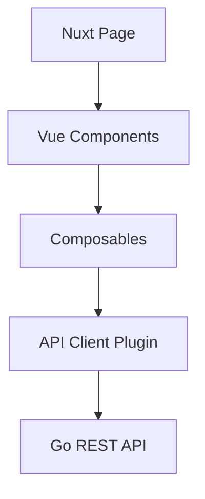
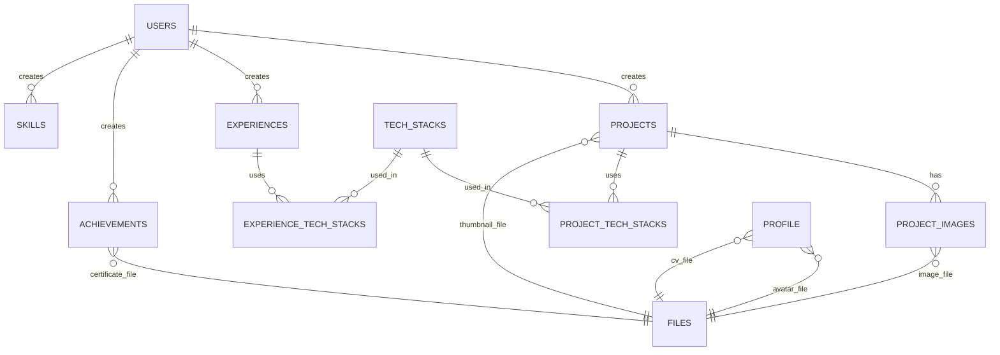
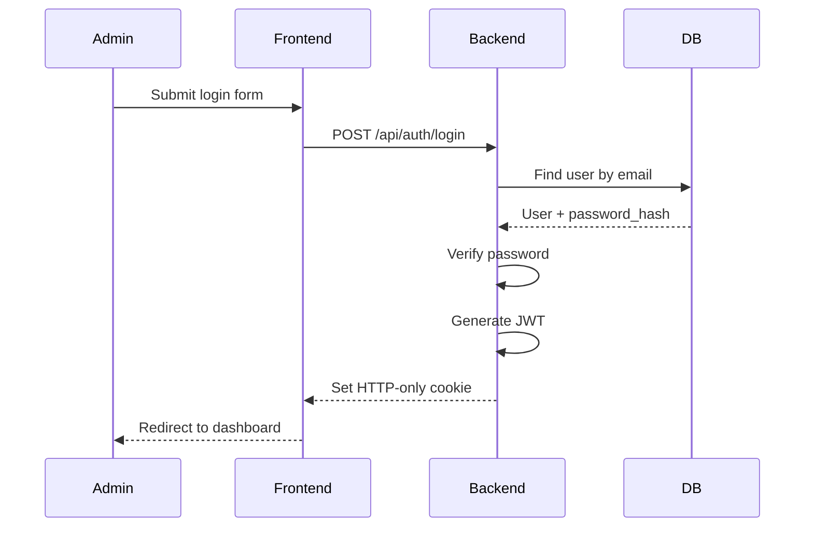
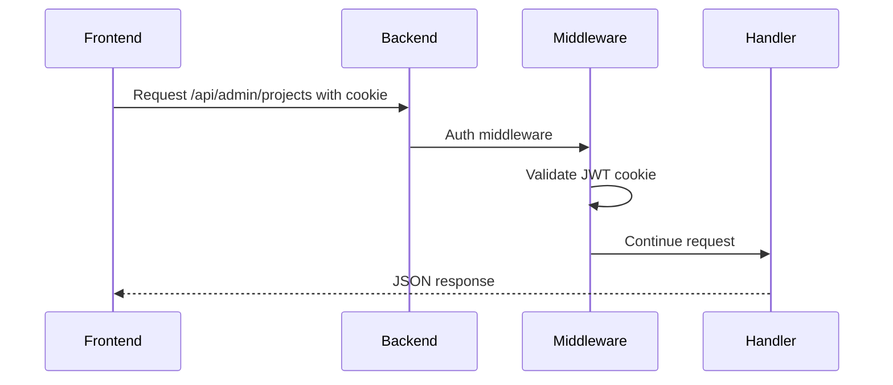
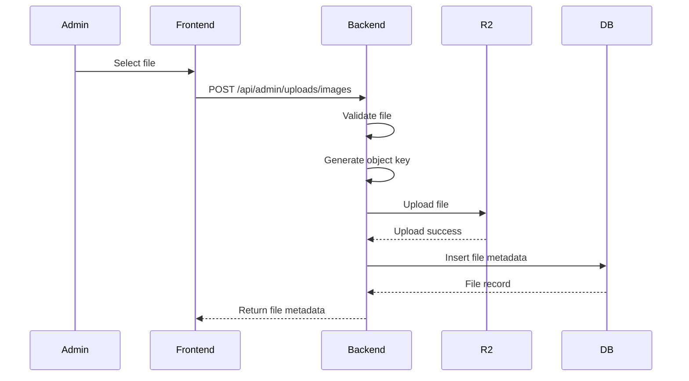
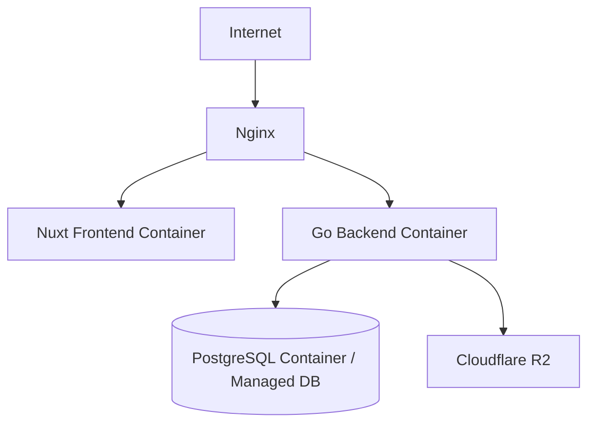

# Technical Design Document — Website Portofolio Developer

**Versi:** 1.0  
**Sumber:** PRD Website Portofolio Developer  
**Status:** Draft Technical Design  
**Target Stack:** Nuxt, Go, PostgreSQL, Cloudflare R2, Docker, Nginx

---

## 1. Ringkasan Teknis

Website Portofolio Developer adalah aplikasi web personal berbasis **database-driven content**. Konten utama seperti profil, project, pengalaman, skill, achievement, dan file pendukung dikelola melalui **dashboard admin** tanpa perlu mengubah kode utama aplikasi.

Sistem dibangun menggunakan arsitektur full-stack dengan pemisahan frontend dan backend:

- **Frontend:** Nuxt untuk public portfolio dan admin dashboard.
- **Backend:** Go untuk REST API, autentikasi, validasi, dan integrasi storage.
- **Database:** PostgreSQL untuk data terstruktur.
- **Storage:** Cloudflare R2 untuk gambar, CV, sertifikat, dan file pendukung.
- **Deployment:** VPS menggunakan Docker dan Nginx sebagai reverse proxy.

---

## 2. Tujuan Technical Design

Dokumen ini menjelaskan desain teknis untuk mengimplementasikan PRD Website Portofolio Developer, mencakup:

1. Arsitektur sistem.
2. Pembagian frontend dan backend.
3. Desain database.
4. Desain API.
5. Autentikasi dan otorisasi.
6. Upload file ke Cloudflare R2.
7. Strategi SEO dan performa.
8. Security requirements.
9. Deployment architecture.
10. Rencana implementasi bertahap.

---

## 3. Scope Teknis

### 3.1 Scope Teknis Keseluruhan Produk
Daftar berikut adalah scope teknis keseluruhan produk. Untuk implementasi bertahap, scope dibagi lagi menjadi MVP Core, MVP Extended, dan Future Scope pada section 3.3 sampai 3.5.

- Public website portfolio.
- Admin login.
- Admin dashboard.
- CRUD project.
- CRUD profile.
- CRUD experience.
- CRUD achievement.
- CRUD skill.
- Upload gambar dan file ke Cloudflare R2.
- Public API untuk menampilkan data portfolio.
- Admin API untuk mengelola konten.
- Database PostgreSQL.
- Docker deployment.
- Nginx reverse proxy.
- Basic SEO support.

### 3.2 Tidak Termasuk dalam Scope Teknis Awal

- Multi-user admin kompleks.
- Blog system lengkap.
- Payment gateway.
- Real-time chat.
- Analytics dashboard kompleks.
- Marketplace jasa.
- Role-based access control yang kompleks.

## 3.3 MVP Core Technical Scope

Fitur yang wajib dikerjakan pada versi pertama:

- Public landing page
- About/profile developer
- Project list
- Project detail
- Login admin
- Admin CRUD project
- Upload thumbnail project ke Cloudflare R2
- Public API profile
- Public API projects
- Basic SEO
- Responsive design
- Docker deployment

## 3.4 MVP Extended Technical Scope

Fitur setelah MVP Core stabil:

- CRUD experience
- CRUD achievement
- CRUD skill
- Upload certificate
- Download CV
- Search and filter project
- Preview before publish
- Contact form backend

## 3.5 Future Scope

- Blog
- Newsletter
- Analytics
- Multi-language
- GitHub API integration

---

## 4. High-Level Architecture



### Penjelasan

- Pengunjung mengakses public portfolio melalui Nuxt frontend.
- Admin mengakses dashboard melalui route `/admin/*`.
- Frontend mengambil data dari backend Go melalui REST API.
- Backend membaca dan menulis data ke PostgreSQL.
- File seperti gambar project, avatar, CV, dan sertifikat disimpan di Cloudflare R2.
- Database hanya menyimpan metadata file, bukan binary file.

---

## 5. Technology Stack

| Layer | Teknologi | Fungsi |
|---|---|---|
| Frontend | Nuxt | Public portfolio, admin dashboard, routing, SEO |
| Backend | Go | REST API, auth, validation, business logic |
| Database | PostgreSQL | Penyimpanan data portfolio terstruktur |
| Storage | Cloudflare R2 | Penyimpanan file gambar, CV, dan sertifikat |
| Auth | JWT via HTTP-only Cookie | Session admin yang lebih aman |
| Reverse Proxy | Nginx | Routing request ke frontend/backend |
| Deployment | Docker + VPS | Containerized deployment |
| Version Control | Git | Source control |

---

## 6. System Component Design

## 6.1 Frontend — Nuxt

Frontend bertugas menampilkan halaman public portfolio dan admin dashboard.

### Public Pages

| Route | Fungsi |
|---|---|
| `/` | Landing page utama |
| `/about` | Informasi developer |
| `/projects` | Daftar project |
| `/projects/[slug]` | Detail project |
| `/experience` | Daftar pengalaman |
| `/achievements` | Prestasi dan sertifikasi |
| `/skills` | Daftar skill |
| `/contact` | Kontak developer |

### Admin Pages

| Route | Fungsi |
|---|---|
| `/admin/login` | Login admin |
| `/admin/dashboard` | Ringkasan dashboard |
| `/admin/projects` | List project admin |
| `/admin/projects/create` | Form tambah project |
| `/admin/projects/[id]` | Form edit project |
| `/admin/experiences` | Manajemen pengalaman |
| `/admin/achievements` | Manajemen prestasi/sertifikasi |
| `/admin/skills` | Manajemen skill |
| `/admin/profile` | Manajemen profil |

### Tanggung Jawab Frontend

- Render halaman public portfolio.
- Render admin dashboard.
- Mengambil data dari public API.
- Mengirim request CRUD ke admin API.
- Menangani form validation di sisi client.
- Menampilkan loading state, error state, dan empty state.
- Mengatur metadata SEO per halaman.
- Menampilkan gambar/file dari URL Cloudflare R2.

## 6.1.1 Frontend Page Priority

### MVP Core Pages
| Route | Status |
|---|---|
| `/` | Required |
| `/projects` | Required |
| `/projects/[slug]` | Required |
| `/admin/login` | Required |
| `/admin/dashboard` | Required |
| `/admin/projects` | Required |
| `/admin/projects/create` | Required |
| `/admin/projects/[id]` | Required |

### MVP Extended Pages
| Route | Status |
|---|---|
| `/experience` | Extended |
| `/achievements` | Extended |
| `/skills` | Extended |
| `/admin/experiences` | Extended |
| `/admin/achievements` | Extended |
| `/admin/skills` | Extended |
| `/admin/profile` | Extended, tetapi profile public tetap dibutuhkan |

### Future Pages
| Route | Status |
|---|---|
| `/blog` | Future |
| `/case-studies` | Future |

---

## 6.2 Backend — Go REST API

Backend bertugas menyediakan REST API untuk public website dan admin dashboard.

### Tanggung Jawab Backend

- Menyediakan endpoint public untuk data published.
- Menyediakan endpoint admin untuk CRUD data.
- Menangani autentikasi admin.
- Menangani otorisasi endpoint `/api/admin/*`.
- Validasi request payload.
- Upload file ke Cloudflare R2.
- Menyimpan metadata file ke PostgreSQL.
- Mengelola status project seperti `draft`, `published`, dan `archived`.
- Menyediakan response JSON yang konsisten.

---

## 6.3 Database — PostgreSQL

PostgreSQL digunakan untuk menyimpan data terstruktur:

- Users.
- Profile.
- Projects.
- Project images.
- Tech stacks.
- Experiences.
- Achievements.
- Skills.
- Contact messages.
- Files metadata.

Database tidak menyimpan file binary. File fisik disimpan di Cloudflare R2.

---

## 6.4 Object Storage — Cloudflare R2

Cloudflare R2 digunakan untuk menyimpan:

- Avatar developer.
- CV.
- Thumbnail project.
- Screenshot project.
- Sertifikat.
- Dokumen pendukung.

Contoh object key:

```txt
profile/avatar.webp
profile/cv.pdf
projects/sales-dashboard/thumbnail.webp
projects/sales-dashboard/gallery-1.webp
certificates/bangkit-certificate.pdf
```

---

## 7. Folder Structure

```txt
portfolio-website/
├── frontend/
│   ├── assets/
│   ├── components/
│   │   ├── sections/
│   │   ├── cards/
│   │   ├── forms/
│   │   └── layout/
│   ├── composables/
│   ├── layouts/
│   ├── middleware/
│   ├── pages/
│   │   ├── index.vue
│   │   ├── about.vue
│   │   ├── contact.vue
│   │   ├── projects/
│   │   └── admin/
│   ├── plugins/
│   ├── public/
│   ├── types/
│   ├── nuxt.config.ts
│   └── package.json
│
├── backend/
│   ├── cmd/
│   │   └── api/
│   │       └── main.go
│   ├── internal/
│   │   ├── config/
│   │   ├── database/
│   │   ├── middleware/
│   │   ├── models/
│   │   ├── repositories/
│   │   ├── services/
│   │   ├── handlers/
│   │   ├── routes/
│   │   └── utils/
│   ├── migrations/
│   ├── go.mod
│   └── Dockerfile
│
├── nginx/
│   └── default.conf
├── docker/
│   ├── frontend.Dockerfile
│   └── backend.Dockerfile
├── docker-compose.yml
├── README.md
└── .gitignore
```

---

## 8. Backend Architecture

Backend menggunakan pendekatan layered architecture.



### 8.1 Layer Responsibilities

| Layer | Tanggung Jawab |
|---|---|
| Routes | Mendaftarkan endpoint API |
| Middleware | Auth, CORS, logging, rate limit |
| Handler | Parse request, validasi dasar, response |
| Service | Business logic |
| Repository | Query database |
| Model | Struktur data dan mapping database |
| Utils | Helper seperti slug, response, JWT, validation |

---

## 9. Backend Module Design

## 9.1 Auth Module

### Fungsi

- Login admin.
- Logout admin.
- Get current admin.
- Generate JWT.
- Set token ke HTTP-only cookie.
- Validasi token dari cookie.

### File Terkait

```txt
backend/internal/handlers/auth_handler.go
backend/internal/services/auth_service.go
backend/internal/middleware/auth.go
backend/internal/utils/jwt.go
```

---

## 9.2 Project Module

### Fungsi

- Public list project published.
- Public detail project berdasarkan slug.
- Admin list semua project.
- Admin create project.
- Admin update project.
- Admin delete project.
- Assign thumbnail.
- Assign tech stack.
- Manage project status.

### File Terkait

```txt
backend/internal/models/project.go
backend/internal/repositories/project_repository.go
backend/internal/services/project_service.go
backend/internal/handlers/project_handler.go
```

---

## 9.3 Upload Module

### Fungsi

- Validasi file.
- Upload file ke Cloudflare R2.
- Generate object key.
- Simpan metadata file ke PostgreSQL.
- Delete file dari R2 dan database.

### File Terkait

```txt
backend/internal/services/upload_service.go
backend/internal/handlers/upload_handler.go
```

---

## 9.4 Profile Module
Untuk MVP Core, data profile dapat dibuat melalui seed database atau migration awal. CRUD profile admin masuk MVP Extended.

### Fungsi

- Public get profile.
- Public get CV URL.
- Admin update profile.
- Assign avatar file.
- Assign CV file.

---

## 9.5 Experience Module

### Fungsi

- Public list experience.
- Admin CRUD experience.
- Assign tech stack to experience.
- Sorting berdasarkan tanggal.

---

## 9.6 Achievement Module

### Fungsi

- Public list achievement.
- Admin CRUD achievement.
- Assign certificate file.
- Support credential URL.

---

## 9.7 Skill Module

### Fungsi

- Public list skill.
- Admin CRUD skill.
- Grouping berdasarkan kategori.

---

## 9.8 Module Priority

### MVP Core Modules
- Auth Module
- Profile Public Module
- Project Module
- Upload Module
- File Metadata Module

### MVP Extended Modules
- Experience Module
- Achievement Module
- Skill Module
- Contact Message Module

### Future Modules
- Blog Module
- Analytics Module
- Newsletter Module

---

## 9.9 Tech Stack Module

### Fungsi

- Public list tech stack jika dibutuhkan.
- Admin create tech stack.
- Admin update tech stack.
- Admin delete tech stack.
- Assign tech stack ke project.
- Assign tech stack ke experience.

### File Terkait

backend/internal/models/tech_stack.go
backend/internal/repositories/tech_stack_repository.go
backend/internal/services/tech_stack_service.go
backend/internal/handlers/tech_stack_handler.go

---

## 10. Frontend Architecture



### 10.1 Frontend Layer Responsibilities

| Layer | Tanggung Jawab |
|---|---|
| Pages | Route-level rendering |
| Components | UI reusable components |
| Composables | Data fetching and state logic |
| Plugins | API client configuration |
| Middleware | Protect admin route |
| Types | TypeScript interface |

---

## 10.2 Recommended Frontend Composables

```txt
useProfile.ts
useProjects.ts
useExperiences.ts
useAchievements.ts
useSkills.ts
useAuth.ts
useUploads.ts
useContact.ts
```

### Contoh Tanggung Jawab `useProjects`

- `getPublishedProjects()`
- `getProjectBySlug(slug)`
- `getAdminProjects()`
- `createProject(payload)`
- `updateProject(id, payload)`
- `deleteProject(id)`

---

## 10.3 Admin Route Protection

Admin route dilindungi menggunakan Nuxt route middleware.

Contoh behavior:

```txt
Jika user belum login dan membuka /admin/dashboard:
- Frontend memanggil GET /api/auth/me.
- Jika response 401, redirect ke /admin/login.
- Jika response 200, halaman admin ditampilkan.
```

---

## 11. Database Design

## 11.1 Entity List

| Tabel | Fungsi |
|---|---|
| users | Akun admin/developer |
| profile | Profil utama developer |
| projects | Data project |
| project_images | Galeri gambar project |
| tech_stacks | Master teknologi |
| project_tech_stacks | Pivot project dan tech stack |
| experiences | Data pengalaman |
| experience_tech_stacks | Pivot experience dan tech stack |
| achievements | Data prestasi/sertifikasi |
| skills | Data skill |
| files | Metadata file Cloudflare R2 |
| contact_messages | Pesan kontak |

---

## 11.2 ERD



---

## 11.3 Table Design

### 11.3.1 `users`

| Column | Type | Constraint | Description |
|---|---|---|---|
| id | UUID | PK | User ID |
| name | VARCHAR(150) | NOT NULL | Nama admin |
| email | VARCHAR(255) | UNIQUE, NOT NULL | Email login |
| password_hash | TEXT | NOT NULL | Password hash |
| role | VARCHAR(50) | NOT NULL | Role admin/owner |
| created_at | TIMESTAMP | NOT NULL | Created time |
| updated_at | TIMESTAMP | NOT NULL | Updated time |

---

### 11.3.2 `profile`

| Column | Type | Constraint | Description |
|---|---|---|---|
| id | UUID | PK | Profile ID |
| full_name | VARCHAR(150) | NOT NULL | Nama lengkap |
| headline | VARCHAR(255) | NULL | Role/headline |
| bio | TEXT | NULL | Deskripsi developer |
| location | VARCHAR(150) | NULL | Lokasi umum |
| email | VARCHAR(255) | NULL | Email kontak |
| phone | VARCHAR(50) | NULL | Nomor kontak opsional |
| github_url | TEXT | NULL | Link GitHub |
| linkedin_url | TEXT | NULL | Link LinkedIn |
| website_url | TEXT | NULL | Link website |
| avatar_file_id | UUID | FK files.id | Avatar |
| cv_file_id | UUID | FK files.id | CV |
| created_at | TIMESTAMP | NOT NULL | Created time |
| updated_at | TIMESTAMP | NOT NULL | Updated time |

---

### 11.3.3 `projects`

| Column | Type | Constraint | Description |
|---|---|---|---|
| id | UUID | PK | Project ID |
| user_id | UUID | FK users.id | Creator |
| title | VARCHAR(255) | NOT NULL | Judul project |
| slug | VARCHAR(255) | UNIQUE, NOT NULL | Slug SEO |
| short_description | TEXT | NULL | Deskripsi singkat |
| description | TEXT | NULL | Deskripsi detail |
| project_type | VARCHAR(100) | NULL | Jenis project |
| status | VARCHAR(50) | NOT NULL | draft/published/archived |
| demo_url | TEXT | NULL | Link demo |
| repository_url | TEXT | NULL | Link repository |
| documentation_url | TEXT | NULL | Link dokumentasi |
| thumbnail_file_id | UUID | FK files.id | Thumbnail |
| is_featured | BOOLEAN | DEFAULT false | Featured project |
| display_order | INT | DEFAULT 0 | Urutan tampil |
| started_at | DATE | NULL | Tanggal mulai |
| completed_at | DATE | NULL | Tanggal selesai |
| created_at | TIMESTAMP | NOT NULL | Created time |
| updated_at | TIMESTAMP | NOT NULL | Updated time |

---

### 11.3.4 `project_images`

| Column | Type | Constraint | Description |
|---|---|---|---|
| id | UUID | PK | Image ID |
| project_id | UUID | FK projects.id | Project |
| file_id | UUID | FK files.id | File metadata |
| image_type | VARCHAR(100) | NULL | cover/gallery/screenshot |
| caption | TEXT | NULL | Caption |
| display_order | INT | DEFAULT 0 | Urutan tampil |
| created_at | TIMESTAMP | NOT NULL | Created time |
| updated_at | TIMESTAMP | NOT NULL | Updated time |

---

### 11.3.5 `tech_stacks`

| Column | Type | Constraint | Description |
|---|---|---|---|
| id | UUID | PK | Tech stack ID |
| name | VARCHAR(100) | NOT NULL | Nama teknologi |
| category | VARCHAR(100) | NULL | Kategori |
| icon_url | TEXT | NULL | Icon URL |
| display_order | INT | DEFAULT 0 | Urutan tampil |
| created_at | TIMESTAMP | NOT NULL | Created time |
| updated_at | TIMESTAMP | NOT NULL | Updated time |

---

### 11.3.6 Pivot Tables

#### `project_tech_stacks`

| Column | Type | Constraint |
|---|---|---|
| project_id | UUID | PK, FK projects.id |
| tech_stack_id | UUID | PK, FK tech_stacks.id |

#### `experience_tech_stacks`

| Column | Type | Constraint |
|---|---|---|
| experience_id | UUID | PK, FK experiences.id |
| tech_stack_id | UUID | PK, FK tech_stacks.id |

---

### 11.3.7 `experiences`

| Column | Type | Constraint | Description |
|---|---|---|---|
| id | UUID | PK | Experience ID |
| user_id | UUID | FK users.id | Creator |
| title | VARCHAR(255) | NOT NULL | Posisi/peran |
| company_name | VARCHAR(255) | NULL | Instansi/perusahaan |
| employment_type | VARCHAR(100) | NULL | Jenis pengalaman |
| location | VARCHAR(150) | NULL | Lokasi |
| description | TEXT | NULL | Deskripsi |
| start_date | DATE | NULL | Mulai |
| end_date | DATE | NULL | Selesai |
| is_current | BOOLEAN | DEFAULT false | Masih aktif |
| display_order | INT | DEFAULT 0 | Urutan tampil |
| created_at | TIMESTAMP | NOT NULL | Created time |
| updated_at | TIMESTAMP | NOT NULL | Updated time |

---

### 11.3.8 `achievements`

| Column | Type | Constraint | Description |
|---|---|---|---|
| id | UUID | PK | Achievement ID |
| user_id | UUID | FK users.id | Creator |
| title | VARCHAR(255) | NOT NULL | Judul |
| issuer | VARCHAR(255) | NULL | Penerbit/penyelenggara |
| description | TEXT | NULL | Deskripsi |
| issued_date | DATE | NULL | Tanggal terbit |
| expired_date | DATE | NULL | Tanggal kedaluwarsa |
| achievement_type | VARCHAR(100) | NULL | certification/competition/award |
| level | VARCHAR(100) | NULL | campus/regional/national/international |
| credential_id | VARCHAR(255) | NULL | Credential ID |
| external_url | TEXT | NULL | URL credential |
| certificate_file_id | UUID | FK files.id | Sertifikat |
| display_order | INT | DEFAULT 0 | Urutan tampil |
| created_at | TIMESTAMP | NOT NULL | Created time |
| updated_at | TIMESTAMP | NOT NULL | Updated time |

---

### 11.3.9 `skills`

| Column | Type | Constraint | Description |
|---|---|---|---|
| id | UUID | PK | Skill ID |
| user_id | UUID | FK users.id | Creator |
| name | VARCHAR(100) | NOT NULL | Nama skill |
| category | VARCHAR(100) | NULL | Kategori |
| proficiency_level | INT | NULL | 1-5 |
| icon_url | TEXT | NULL | Icon URL |
| display_order | INT | DEFAULT 0 | Urutan tampil |
| created_at | TIMESTAMP | NOT NULL | Created time |
| updated_at | TIMESTAMP | NOT NULL | Updated time |

---

### 11.3.10 `files`

| Column | Type | Constraint | Description |
|---|---|---|---|
| id | UUID | PK | File ID |
| file_name | VARCHAR(255) | NOT NULL | Nama file |
| file_key | TEXT | UNIQUE, NOT NULL | Object key R2 |
| file_url | TEXT | NOT NULL | Public URL |
| bucket_name | VARCHAR(255) | NOT NULL | Bucket name |
| mime_type | VARCHAR(100) | NOT NULL | MIME type |
| file_size | BIGINT | NOT NULL | Ukuran bytes |
| file_type | VARCHAR(100) | NOT NULL | image/cv/certificate/document |
| storage_provider | VARCHAR(100) | NOT NULL | cloudflare_r2 |
| created_at | TIMESTAMP | NOT NULL | Created time |
| updated_at | TIMESTAMP | NOT NULL | Updated time |

---

### 11.3.11 `contact_messages`

| Column | Type | Constraint | Description |
|---|---|---|---|
| id | UUID | PK | Message ID |
| name | VARCHAR(150) | NOT NULL | Nama pengirim |
| email | VARCHAR(255) | NOT NULL | Email pengirim |
| subject | VARCHAR(255) | NULL | Subjek |
| message | TEXT | NOT NULL | Isi pesan |
| status | VARCHAR(50) | DEFAULT new | new/read/replied/archived |
| created_at | TIMESTAMP | NOT NULL | Created time |
| updated_at | TIMESTAMP | NOT NULL | Updated time |

---

## 11.4 Recommended Indexes

| Table | Index |
|---|---|
| users | email unique index |
| projects | slug unique index |
| projects | status index |
| projects | is_featured index |
| projects | display_order index |
| files | file_key unique index |
| skills | category index |
| contact_messages | status index |

---

## 11.5 Database Constraints

### Project Status

Kolom `projects.status` hanya boleh memiliki nilai:

- draft
- published
- archived

SQL:

```sql
ALTER TABLE projects
ADD CONSTRAINT chk_projects_status
CHECK (status IN ('draft', 'published', 'archived'));

ALTER TABLE skills
ADD CONSTRAINT chk_skills_proficiency
CHECK (proficiency_level BETWEEN 1 AND 5);

ALTER TABLE contact_messages
ADD CONSTRAINT chk_contact_messages_status
CHECK (status IN ('new', 'read', 'replied', 'archived'));

ALTER TABLE achievements
ADD CONSTRAINT chk_achievements_level
CHECK (
  level IN ('campus', 'regional', 'national', 'international')
  OR level IS NULL
);
```

---

## 11.6 Foreign Key Delete Behavior

| Relasi | Delete Behavior | Alasan |
|---|---|---|
| projects → project_images | ON DELETE CASCADE | Jika project dihapus, galeri ikut hilang |
| projects → project_tech_stacks | ON DELETE CASCADE | Pivot tidak boleh orphan |
| experiences → experience_tech_stacks | ON DELETE CASCADE | Pivot tidak boleh orphan |
| users → projects | RESTRICT atau SET NULL | Hindari data project terhapus tidak sengaja |
| files → projects thumbnail | SET NULL | File dikelola oleh upload service |
| files → profile avatar/cv | SET NULL | File bisa diganti tanpa menghapus profile |

---

## 11.7 Migration Priority

### MVP Core Migrations
1. users
2. files
3. profile
4. projects
5. project_images
6. tech_stacks
7. project_tech_stacks

### MVP Extended Migrations
8. experiences
9. experience_tech_stacks
10. achievements
11. skills
12. contact_messages

---

## 12. API Design

## 12.1 Response Format

### Success Response

```json
{
  "success": true,
  "message": "Request successful",
  "data": {}
}
```

### Error Response

```json
{
  "success": false,
  "message": "Validation error",
  "errors": {
    "title": "Title is required"
  }
}
```

---

## 12.2 HTTP Status Code Standard

| Code | Meaning |
|---|---|
| 200 | OK |
| 201 | Created |
| 400 | Bad Request |
| 401 | Unauthorized |
| 403 | Forbidden |
| 404 | Not Found |
| 409 | Conflict |
| 422 | Validation Error |
| 429 | Too Many Requests |
| 500 | Internal Server Error |

---

## 12.3 Auth API

### POST `/api/auth/login`

Request:

```json
{
  "email": "admin@example.com",
  "password": "password"
}
```

Response:

```json
{
  "success": true,
  "message": "Login successful",
  "data": {
    "user": {
      "id": "uuid",
      "name": "Admin",
      "email": "admin@example.com",
      "role": "owner"
    }
  }
}
```

Cookie:

```txt
Set-Cookie: access_token=<jwt>; HttpOnly; Secure; SameSite=Lax; Path=/
```

---

### POST `/api/auth/logout`

Behavior:

- Clear auth cookie.
- Return success response.

---

### GET `/api/auth/me`

Response:

```json
{
  "success": true,
  "data": {
    "id": "uuid",
    "name": "Admin",
    "email": "admin@example.com",
    "role": "owner"
  }
}
```

---

## 12.4 Public Portfolio API

### GET `/api/profile`

Response:

```json
{
  "success": true,
  "data": {
    "fullName": "Developer Name",
    "headline": "Backend Developer | Data Enthusiast",
    "bio": "Short profile bio",
    "location": "Indonesia",
    "email": "developer@example.com",
    "githubUrl": "https://github.com/username",
    "linkedinUrl": "https://linkedin.com/in/username",
    "avatarUrl": "https://cdn.domain.com/profile/avatar.webp",
    "cvUrl": "https://cdn.domain.com/profile/cv.pdf"
  }
}
```

---

### GET `/api/projects`

Query params:

| Param | Description |
|---|---|
| category | Filter by project type/category |
| search | Search by title or description |
| sort | latest/oldest/display_order |
| featured | true/false |

Response:

```json
{
  "success": true,
  "data": [
    {
      "id": "uuid",
      "title": "Sales Analytics Dashboard",
      "slug": "sales-analytics-dashboard",
      "shortDescription": "Dashboard analitik penjualan",
      "projectType": "dashboard",
      "thumbnailUrl": "https://cdn.domain.com/projects/sales-dashboard/thumbnail.webp",
      "isFeatured": true,
      "techStacks": ["Vue 3", "Laravel", "MySQL"]
    }
  ]
}
```

---

### GET `/api/projects/:slug`

Behavior:

- Return project detail if status is `published`.
- Return `404 Not Found` if project does not exist or status is not `published`.

---

## 12.5 Admin Project API

| Method | Endpoint | Description |
|---|---|---|
| GET | `/api/admin/projects` | List all projects including draft and archived |
| GET | `/api/admin/projects/:id` | Get project detail for edit |
| POST | `/api/admin/projects` | Create project |
| PUT | `/api/admin/projects/:id` | Update project |
| DELETE | `/api/admin/projects/:id` | Delete project |

### POST `/api/admin/projects`

Request:

```json
{
  "title": "Sales Analytics Dashboard",
  "slug": "sales-analytics-dashboard",
  "shortDescription": "Dashboard analitik penjualan",
  "description": "Long project description",
  "projectType": "dashboard",
  "status": "draft",
  "demoUrl": "https://example.com",
  "repositoryUrl": "https://github.com/user/repo",
  "documentationUrl": "https://docs.example.com",
  "thumbnailFileId": "uuid",
  "isFeatured": false,
  "displayOrder": 1,
  "startedAt": "2025-01-01",
  "completedAt": "2025-03-01",
  "techStackIds": ["uuid-1", "uuid-2"]
}
```

Validation:

| Field | Rule |
|---|---|
| title | required, max 255 |
| slug | required, unique, lowercase kebab-case |
| status | required, one of draft/published/archived |
| demoUrl | optional, valid URL |
| repositoryUrl | optional, valid URL |

---

## 12.6 Upload API

### POST `/api/admin/uploads/images`

Content-Type:

```txt
multipart/form-data
```

Fields:

| Field | Description |
|---|---|
| file | Image file |
| folder | Optional target folder |
| fileType | avatar/thumbnail/gallery |

Allowed file:

| Type | Max Size |
|---|---|
| jpg/jpeg | 5 MB |
| png | 5 MB |
| webp | 5 MB |

Response:

```json
{
  "success": true,
  "message": "File uploaded successfully",
  "data": {
    "id": "uuid",
    "fileName": "thumbnail.webp",
    "fileKey": "projects/sales-dashboard/thumbnail.webp",
    "fileUrl": "https://cdn.domain.com/projects/sales-dashboard/thumbnail.webp",
    "mimeType": "image/webp",
    "fileSize": 248000,
    "fileType": "thumbnail"
  }
}
```

---

## 12.7 Admin Profile API

| Method | Endpoint | Description |
|---|---|---|
| GET | `/api/admin/profile` | Get profile for admin |
| PUT | `/api/admin/profile` | Update profile |

---

## 12.8 Admin Experience API

| Method | Endpoint | Description |
|---|---|---|
| GET | `/api/admin/experiences` | List all experiences |
| GET | `/api/admin/experiences/:id` | Get experience detail |
| POST | `/api/admin/experiences` | Create experience |
| PUT | `/api/admin/experiences/:id` | Update experience |
| DELETE | `/api/admin/experiences/:id` | Delete experience |

---

## 12.9 Admin Achievement API

| Method | Endpoint | Description |
|---|---|---|
| GET | `/api/admin/achievements` | List all achievements |
| GET | `/api/admin/achievements/:id` | Get achievement detail |
| POST | `/api/admin/achievements` | Create achievement |
| PUT | `/api/admin/achievements/:id` | Update achievement |
| DELETE | `/api/admin/achievements/:id` | Delete achievement |

---

## 12.10 Admin Skill API

| Method | Endpoint | Description |
|---|---|---|
| GET | `/api/admin/skills` | List all skills |
| POST | `/api/admin/skills` | Create skill |
| PUT | `/api/admin/skills/:id` | Update skill |
| DELETE | `/api/admin/skills/:id` | Delete skill |

---

## 12.11 Admin Tech Stack API

| Method | Endpoint | Description |
|---|---|---|
| GET | `/api/admin/tech-stacks` | List tech stacks |
| POST | `/api/admin/tech-stacks` | Create tech stack |
| PUT | `/api/admin/tech-stacks/:id` | Update tech stack |
| DELETE | `/api/admin/tech-stacks/:id` | Delete tech stack |

---

## 12.12 MVP Extended Public API

| Method | Endpoint | Description |
|---|---|---|
| GET | `/api/experiences` | List public experiences |
| GET | `/api/achievements` | List public achievements/certifications |
| GET | `/api/skills` | List public skills grouped by category |

---

## 12.13 DTO and Response Mapper

Backend tidak boleh langsung mengembalikan model database sebagai response API.
Gunakan DTO untuk membatasi field yang dikirim ke frontend.

### Public DTO
- ProfilePublicResponse
- ProjectListItemResponse
- ProjectDetailResponse
- ExperiencePublicResponse
- AchievementPublicResponse
- SkillPublicResponse

### Admin DTO
- ProjectAdminResponse
- ExperienceAdminResponse
- AchievementAdminResponse
- SkillAdminResponse
- FileAdminResponse
- UserMeResponse

example:
```
type ProjectListItemResponse struct {
    ID               string   `json:"id"`
    Title            string   `json:"title"`
    Slug             string   `json:"slug"`
    ShortDescription string   `json:"shortDescription"`
    ProjectType      string   `json:"projectType"`
    ThumbnailURL     string   `json:"thumbnailUrl"`
    IsFeatured       bool     `json:"isFeatured"`
    TechStacks       []string `json:"techStacks"`
}
```
---

## 13. Authentication and Authorization Design

## 13.1 Auth Flow



---

## 13.2 Admin Request Flow



---

## 13.3 Cookie Configuration

| Attribute | Value |
|---|---|
| HttpOnly | true |
| Secure | true on production |
| SameSite | Lax |
| Path | / |
| MaxAge | configurable |

---

## 13.4 Auth Technical Decision

Untuk MVP:

- Gunakan JWT access token di HTTP-only cookie.
- Tidak menggunakan refresh token terlebih dahulu.
- Token lifetime: 24 jam atau 7 hari.
- Logout dilakukan dengan clear cookie.
- Endpoint `/api/admin/*` membaca token dari cookie.
- Endpoint `/api/auth/me` digunakan frontend untuk validasi sesi.
- Password menggunakan bcrypt minimal cost 10 atau 12.
- Login endpoint wajib rate limited.

## 13.5 CSRF Consideration

Karena token disimpan di cookie, browser akan mengirim cookie otomatis.

Mitigasi MVP:

- Gunakan SameSite=Lax.
- Gunakan CORS strict hanya untuk domain frontend resmi.
- Gunakan method aman dan validasi origin untuk request admin.
- Jika admin API semakin kompleks, tambahkan CSRF token.

---

## 14. File Upload and Cloudflare R2 Design

## 14.1 Upload Flow



---

## 14.2 File Validation Rules

| File Type | Extension | Max Size | MIME Type |
|---|---|---|---|
| Image | jpg, jpeg, png, webp | 5 MB | image/jpeg, image/png, image/webp |
| Document | pdf | 10 MB | application/pdf |

---

## 14.3 Object Key Convention

```txt
profile/avatar.webp
profile/cv.pdf
projects/{project-slug}/thumbnail.webp
projects/{project-slug}/gallery-{number}.webp
achievements/{achievement-slug}/certificate.pdf
certificates/{certificate-slug}.pdf
```

---

## 14.4 Orphan File Handling

File orphan adalah file yang sudah ada di Cloudflare R2 tetapi tidak digunakan lagi oleh data portfolio.

Mitigasi:

- Saat data dihapus, hapus file terkait jika tidak digunakan entitas lain.
- Saat thumbnail diganti, file lama dapat ditandai sebagai unused atau langsung dihapus.
- Tambahkan scheduled cleanup pada fase lanjutan.

---

## 14.5 R2 Access Decision

Untuk MVP:

- Avatar developer bersifat public.
- Thumbnail project bersifat public.
- Screenshot project bersifat public.
- Sertifikat bersifat public jika memang ingin ditampilkan di portfolio.
- CV bersifat public jika tombol download CV aktif.
- File private belum termasuk MVP.

Backend menyimpan:
- file_key
- file_url
- bucket_name
- mime_type
- file_size
- file_type
- storage_provider

---

## 14.6 Upload Security Rules

- Validasi extension file.
- Validasi MIME type.
- Validasi ukuran file.
- Rename file agar tidak memakai nama asli langsung.
- Generate object key dari slug + timestamp/random suffix.
- Jangan izinkan path traversal seperti `../../file`.
- Jangan upload file executable.

---


## 15. SEO Design

## 15.1 SEO Requirements

- Setiap halaman memiliki title dan meta description.
- Project detail menggunakan slug SEO-friendly.
- Gambar penting memiliki alt text.
- Sitemap tersedia.
- Robots.txt tersedia.
- Halaman public dapat di-crawl search engine.

---

## 15.2 SEO Metadata Strategy

| Page | Title Pattern | Description Source |
|---|---|---|
| Home | `{Name} — Developer Portfolio` | Profile bio |
| Projects | `Projects — {Name}` | Project section summary |
| Project Detail | `{Project Title} — Project` | Project short description |
| About | `About — {Name}` | About summary |
| Contact | `Contact — {Name}` | Contact invitation |

---

## 15.3 Sitemap

Sitemap should include:

```txt
/
/about
/projects
/projects/{slug}
/contact
```

Only `published` project pages should be included.

---

## 15.4 Nuxt SEO Implementation

- Gunakan `useSeoMeta()` untuk title dan description.
- Gunakan slug project untuk route `/projects/[slug]`.
- Generate sitemap hanya untuk project dengan status `published`.
- Tambahkan robots.txt di public folder.
- Gunakan alt text untuk gambar penting.
- Gunakan canonical URL untuk halaman utama dan detail project.

---

## 15.5 SEO Visibility Rule

- Project dengan status `published` boleh masuk sitemap.
- Project dengan status `draft` tidak boleh tampil public.
- Project dengan status `archived` tidak masuk sitemap, kecuali diputuskan tetap public.

---

## 16. Performance Design

## 16.1 Frontend Performance

- Use lazy loading for images.
- Use optimized image format such as WebP.
- Avoid excessive animation.
- Use pagination or lazy fetch for project list if data grows.
- Cache public data where possible.

---

## 16.2 Backend Performance

- Add indexes for frequently queried fields.
- Use pagination for admin list endpoint.
- Avoid returning unnecessary fields.
- Use structured query for project detail with tech stacks and images.

---

## 16.3 Database Performance

Recommended indexes:

```sql
CREATE UNIQUE INDEX idx_users_email ON users(email);
CREATE UNIQUE INDEX idx_projects_slug ON projects(slug);
CREATE INDEX idx_projects_status ON projects(status);
CREATE INDEX idx_projects_is_featured ON projects(is_featured);
CREATE UNIQUE INDEX idx_files_file_key ON files(file_key);
```

---

## 16.4 Performance Target

Target berdasarkan PRD:

- Homepage load time kurang dari 3 detik pada koneksi normal.
- Lighthouse Performance minimal 85 pada mobile.
- Lighthouse SEO minimal 90.
- Gambar project memakai format WebP jika memungkinkan.
- Project list menggunakan pagination atau limit jika data banyak.

---

## 17. Security Design

## 17.1 Security Requirements

- Password admin must be hashed using bcrypt or argon2.
- JWT must be stored in HTTP-only cookie.
- `/api/admin/*` must be protected by auth middleware.
- File upload must validate extension, MIME type, and size.
- Login endpoint must have rate limiting.
- CORS must only allow official frontend domain.
- Public API must never expose sensitive fields.

---

## 17.2 Sensitive Data That Must Not Be Returned

```txt
password_hash
JWT_SECRET
R2_SECRET_ACCESS_KEY
R2_ACCESS_KEY_ID
internal config
raw token
```

---

## 17.3 CORS Policy

Production allowed origin:

```txt
https://domainkamu.com
https://www.domainkamu.com
```

Development allowed origin:

```txt
http://localhost:3000
```

---

## 17.4 Security Checklist

- [ ] Password admin di-hash menggunakan bcrypt/argon2.
- [ ] Endpoint `/api/admin/*` wajib auth middleware.
- [ ] Endpoint public tidak mengembalikan `password_hash`.
- [ ] Cookie auth menggunakan HttpOnly.
- [ ] Cookie auth menggunakan Secure di production.
- [ ] Login endpoint memiliki rate limit.
- [ ] CORS hanya mengizinkan domain frontend resmi.
- [ ] Upload file memvalidasi MIME type, extension, dan size.
- [ ] Error response tidak membocorkan stack trace.
- [ ] Environment variable tidak pernah dikirim ke response.
- [ ] Request admin dengan cookie memvalidasi Origin/Referer di production.
- [ ] SameSite cookie diset minimal Lax.
- [ ] CSRF token dipertimbangkan jika admin API semakin kompleks.

---

## 18. Error Handling Design

## 18.1 Common Error Cases

| Case | HTTP Code | Response |
|---|---|---|
| Invalid login | 401 | Invalid email or password |
| Unauthenticated admin request | 401 | Unauthorized |
| Forbidden access | 403 | Forbidden |
| Data not found | 404 | Resource not found |
| Duplicate slug | 409 | Slug already exists |
| Invalid payload | 422 | Validation error |
| Upload too large | 422 | File size exceeds limit |
| Server error | 500 | Internal server error |

---

## 18.2 Frontend Error States

Frontend must handle:

- Loading state.
- Empty state.
- Validation error.
- Unauthorized redirect.
- Upload failed.
- Server error.
- Not found page for invalid project slug.

---

## 19. Deployment Design

## 19.1 Deployment Architecture



---

## 19.2 Docker Services

| Service | Description |
|---|---|
| frontend | Nuxt app |
| backend | Go REST API |
| postgres | PostgreSQL database |
| nginx | Reverse proxy |

---

## 19.3 Nginx Routing

| Path | Target |
|---|---|
| `/` | Nuxt frontend |
| `/admin/*` | Nuxt frontend |
| `/api/*` | Go backend |

---

## 19.4 Environment Variables

### Backend

| Variable | Description |
|---|---|
| APP_ENV | app environment |
| APP_PORT | backend port |
| DATABASE_URL | PostgreSQL connection string |
| JWT_SECRET | JWT signing secret |
| R2_ACCOUNT_ID | Cloudflare account ID |
| R2_ACCESS_KEY_ID | Cloudflare R2 access key |
| R2_SECRET_ACCESS_KEY | Cloudflare R2 secret key |
| R2_BUCKET_NAME | R2 bucket name |
| R2_PUBLIC_URL | Public CDN URL |

### Frontend

| Variable | Description |
|---|---|
| NUXT_PUBLIC_API_BASE_URL | Backend API base URL |
| NUXT_PUBLIC_SITE_URL | Public website URL |

---

## 19.5 Nuxt Deployment Mode

Untuk MVP, Nuxt dijalankan dalam SSR/server mode.

Alasan:
- Mendukung SEO lebih baik untuk halaman public.
- Cocok untuk halaman project detail berbasis slug.
- Admin dashboard tetap bisa berjalan dalam aplikasi yang sama.

---

## 19.6 Domain Mapping

| URL | Target |
|---|---|
| `https://domainkamu.com` | Nuxt frontend |
| `https://domainkamu.com/projects/:slug` | Nuxt frontend |
| `https://domainkamu.com/admin/*` | Nuxt frontend |
| `https://domainkamu.com/api/*` | Go backend |
| `https://cdn.domainkamu.com/*` | Cloudflare R2 public assets |

---

## 20. Logging and Monitoring

## 20.1 Backend Logging

Backend should log:

- Request method.
- Request path.
- Status code.
- Response time.
- Error message.
- User ID for authenticated admin request.

Sensitive data such as password and token must not be logged.

---

## 20.2 Monitoring Scope for MVP

Minimum monitoring:

- Docker container status.
- Nginx access/error logs.
- Backend application logs.
- Database backup status.
- Storage usage on Cloudflare R2.

---

## 21. Backup and Recovery

## 21.1 Database Backup

Recommended backup strategy:

- Daily PostgreSQL dump.
- Keep last 7 backups.
- Store backup outside application container.
- Test restore periodically.

Example:

```bash
pg_dump "$DATABASE_URL" > backup_$(date +%Y%m%d).sql
```

---

## 21.2 File Backup

Cloudflare R2 stores the primary file objects. For important files such as CV and certificates, optional backup can be stored locally or in another storage provider.

---

## 22. Implementation Phases

## 22.1 Phase 1 — MVP Core

### Milestone 1 — Foundation
- Setup monorepo
- Setup Nuxt
- Setup Go
- Setup PostgreSQL
- Setup Docker Compose
- Setup environment variables

### Milestone 2 — Database Core
- Migration users
- Migration files
- Migration profile
- Migration projects
- Migration project_images
- Migration tech_stacks
- Migration project_tech_stacks
- Seeder admin user

### Milestone 3 — Backend Auth
- POST /api/auth/login
- POST /api/auth/logout
- GET /api/auth/me
- Auth middleware
- Rate limit login

### Milestone 4 — Backend Project
- GET /api/profile
- GET /api/projects
- GET /api/projects/:slug
- GET /api/admin/projects
- POST /api/admin/projects
- PUT /api/admin/projects/:id
- DELETE /api/admin/projects/:id

### Milestone 5 — Frontend Public
- Public layout
- Landing page
- Project list
- Project detail
- Contact link
- Basic SEO

### Milestone 6 — Admin Project Dashboard
- Admin login page
- Admin protected layout
- Project list admin
- Create project
- Edit project
- Delete project

### Milestone 7 — Upload and Deployment
- Upload thumbnail to R2
- Store metadata file
- Dockerfile frontend
- Dockerfile backend
- Nginx reverse proxy
- Deploy VPS
---

## 22.2 Phase 2 — Enhancement

- CRUD experiences.
- CRUD achievements.
- CRUD skills.
- Upload certificate.
- Download CV.
- Search and filter projects.
- Dark mode.
- Animation optimization.
- Performance improvement.

---

## 22.3 Phase 3 — Advanced Personal Branding

- Blog.
- Newsletter.
- Analytics.
- Multi-language.
- GitHub API integration.
- Advanced case study pages.

---

## 23. Testing Strategy

## 23.1 Backend Testing

| Test Type | Scope |
|---|---|
| Unit test | Services, validators, utils |
| Integration test | Repository and database query |
| API test | Auth, project, upload endpoints |
| Security test | Protected admin endpoint |

---

## 23.2 Frontend Testing

| Test Type | Scope |
|---|---|
| Component test | Project card, forms, navbar |
| Page test | Project list, detail, login |
| E2E test | Login admin, create project, view public project |

---

## 23.3 Manual Acceptance Testing

- Visitor can open homepage.
- Visitor can view project list.
- Visitor can open project detail.
- Admin can login.
- Admin can create project.
- Admin can upload thumbnail.
- Published project appears on public page.
- Draft project does not appear on public page.
- Admin can logout.

---

## 23.4 PRD Success Metrics Testing

- [ ] Pengunjung memahami profil developer dalam < 30 detik.
- [ ] Recruiter dapat menemukan project, pengalaman, dan kontak dengan mudah.
- [ ] Tombol download CV dapat ditemukan maksimal 2 klik.
- [ ] Developer dapat menambahkan project baru dari dashboard dalam < 3 menit.
- [ ] Lighthouse Performance mobile minimal 85.
- [ ] Lighthouse SEO minimal 90.
- [ ] Homepage load kurang dari 3 detik pada koneksi normal.
- [ ] Draft project tidak muncul di halaman public.
- [ ] Published project muncul di halaman public.

---

## 24. Risks and Technical Mitigation

| Risk | Impact | Mitigation |
|---|---|---|
| Invalid project data | UI broken | Request validation and fallback UI |
| Large image files | Slow page load | File size validation and WebP format |
| Orphan R2 files | Storage waste | Delete old file on update/delete |
| Exposed admin API | Security issue | Middleware auth for `/api/admin/*` |
| Weak password storage | Account compromise | bcrypt/argon2 hashing |
| Public API leaks sensitive data | Security issue | DTO/response mapper |
| Database loss | Data loss | Scheduled PostgreSQL backup |
| SEO pages not indexed | Low discoverability | Sitemap, meta tags, SSR/SSG |

---

## 25. Technical Decision Options
Section ini berisi opsi yang dipertimbangkan. Keputusan final untuk MVP terdapat pada Section 25.1.

| Topic | Options | Recommendation |
|---|---|---|
| Go Router | Chi, Gin, Fiber | Chi or Gin |
| Migration Tool | golang-migrate, goose | golang-migrate |
| SQL Access | database/sql, sqlc, GORM | GORM dipilih untuk MVP agar CRUD lebih cepat |
| Password Hashing | bcrypt, argon2 | bcrypt for simplicity, argon2 for stronger default |
| Image Processing | Backend resize or direct upload | Start with validation only, add resize later |
| Auth Lifetime | Short JWT vs long session | Short access token + refresh later if needed |

---

## 25.1 Final MVP Technical Decisions

| Topic | Final Decision for MVP |
|---|---|
| Go Router | Gin |
| Migration Tool | golang-migrate |
| SQL Access | GORM |
| Password Hashing | bcrypt |
| Auth Strategy | JWT access token in HTTP-only cookie |
| Refresh Token | Not included in MVP |
| Nuxt Mode | SSR/server mode |
| R2 Access | Public URL for portfolio assets |
| Image Processing | Validation only, resize later |
| Deployment | VPS + Docker Compose + Nginx |

---

## 25.2 GORM Usage Decision

GORM digunakan untuk mempercepat implementasi CRUD pada MVP.

Aturan penggunaan:
- Migration tetap menggunakan golang-migrate, bukan AutoMigrate di production.
- AutoMigrate hanya boleh digunakan untuk eksperimen lokal jika diperlukan, namun tidak digunakan pada staging/production.
- GORM digunakan untuk query CRUD standar.
- Query kompleks boleh menggunakan raw SQL jika dibutuhkan.
- Model database dan DTO response tetap dipisah.

---

## 26. Definition of Done

MVP Core selesai jika:

- [ ] Landing page menampilkan nama, role, tagline, CTA, dan link kontak.
- [ ] About section menampilkan ringkasan developer.
- [ ] Project list menampilkan data dari database.
- [ ] Project detail dapat dibuka berdasarkan slug.
- [ ] Admin dapat login dan logout.
- [ ] Admin dapat membuat, mengedit, menghapus, dan publish/unpublish project.
- [ ] Thumbnail project dapat diupload ke Cloudflare R2.
- [ ] Project draft tidak tampil di public.
- [ ] Public API tidak mengembalikan data sensitif.
- [ ] Website responsive di mobile dan desktop.
- [ ] Meta title dan description tersedia.
- [ ] Sitemap dan robots.txt tersedia.
- [ ] Homepage load kurang dari 3 detik pada koneksi normal.
- [ ] Lighthouse SEO minimal 90.
- [ ] Lighthouse Performance mobile minimal 85.
- [ ] Docker deployment berjalan di VPS.

---

## 27. Appendix

## 27.1 Status Values

### Project Status

```txt
draft
published
archived
```

### Contact Message Status

```txt
new
read
replied
archived
```

---

## 27.2 Skill Proficiency Level

```txt
1 = Beginner
2 = Basic
3 = Intermediate
4 = Advanced
5 = Expert
```

---

## 27.3 Recommended MVP Database Tables

### MVP Core

```txt
users
profile
projects
project_images
tech_stacks
project_tech_stacks
files
```

### MVP Extended

```txt
experiences
experience_tech_stacks
achievements
skills
contact_messages
```

---

## 28. Final Notes

Technical Design Document ini dibuat berdasarkan PRD Website Portofolio Developer. Dokumen ini dapat digunakan sebagai dasar untuk membuat:

- Migration SQL.
- API request-response schema detail.
- Backend task breakdown.
- Frontend task breakdown.
- Docker deployment plan.
- Sprint planning.
